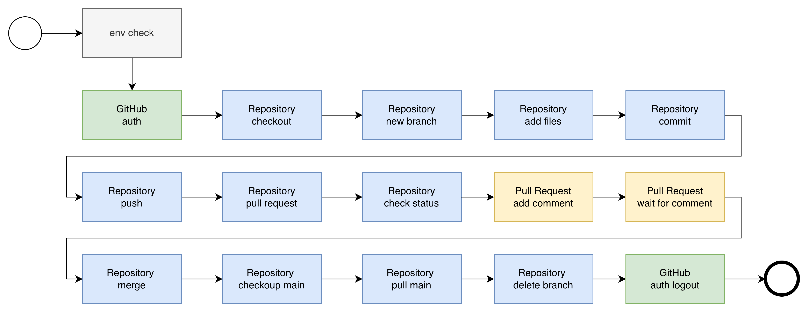

# ansible-tricks

Ansible examples and GitHub Collection development project.



## Key Features

### GitHub Collection (rstyczynski.github)

The `./github_collection` directory contains the Ansible Collection with 16 roles for GitHub operations:

**Collection Information:**
- **FQCN**: rstyczynski.github
- **Version**: 1.0.0
- **License**: MIT
- **Ansible Version**: >= 2.9

**Collection Structure:**
- 16 comprehensive roles organized by operation type
- Complete documentation (Collection + role READMEs)
- Variable validation using validate_argument_spec
- Idempotent operations throughout
- FQCN-based role invocation

**Role Categories:**

**Branch Operations** (5 roles):
- `branch_checkout` - Checkout or create Git branches with remote synchronization
- `branch_delete` - Delete Git branches locally and remotely with safety checks
- `branch_pull` - Pull latest changes from remote branch with fast-forward only strategy
- `branch_push` - Push current branch to remote repository
- `branch_switch` - Switch to a different Git branch

**GitHub Authentication** (3 roles):
- `github_precheck` - Verify Git and GitHub CLI installation and authentication status
- `github_auth` - Authenticate GitHub CLI with token from environment or netrc
- `github_logout` - Logout from GitHub CLI

**Pull Request Operations** (5 roles):
- `pr_create` - Create GitHub pull requests
- `pr_comment` - Add comments to GitHub pull requests
- `pr_status_check` - Check GitHub pull request status checks
- `pr_status_check_pause` - Check PR status with retry and pause mechanism
- `pr_merge` - Merge GitHub pull requests with status check validation

**Repository Operations** (3 roles):
- `repo_clone` - Clone and manage GitHub repositories with proper branch handling
- `repo_file_add` - Add files to Git repository staging area
- `repo_commit` - Commit changes to Git repository

**Usage Example:**

```yaml
---
- name: GitHub workflow using Collection
  hosts: localhost
  tasks:
    - name: Clone repository
      ansible.builtin.include_role:
        name: rstyczynski.github.repo_clone
      vars:
        repo_clone_repo_url: "https://github.com/user/repo.git"
        repo_clone_dest_path: "./repo"
        repo_clone_base_branch: "main"
        repo_clone_new_branch: "feature"
```

## Getting Started

### Prerequisites

- Ansible (version 2.9+)
- Python 3.x
- GitHub CLI (gh)
- Git
- macOS environment (current focus)

### Authentication Setup

GitHub operations require authentication via ~/.netrc file:

```bash
# Create or edit ~/.netrc
cat > ~/.netrc << EOF
machine github.com
login your-github-username
password your-github-token
EOF

# Set proper permissions
chmod 600 ~/.netrc
```

## Recent Updates

### Sprint 9 - Ara API Access

**Status:** implemented

**Backlog Items Implemented:**
- **GHC-14**: Access ara records from remote host - tested ✅

**Key Features Added:**
- Comprehensive curl query examples for Ara REST API (8 use cases)
- Remote access documentation for querying playbook execution records
- Complete tracing examples (playbooks → plays → tasks → results)
- Authentication patterns (unauthenticated, Basic Auth, Bearer Token)
- jq integration examples for JSON processing

**Documentation:**
- Implementation: `progress/sprint_9/sprint_9_implementation.md`
- Tests: `progress/sprint_9/sprint_9_tests.md` (11/11 tests PASSED)
- Design: `progress/sprint_9/sprint_9_design.md`
- Usage: `ara/README.md` (API Queries by Use Case section)
- Backlog traceability: `progress/backlog/GHC-14/`

**Usage Examples:**
See `ara/README.md` for complete curl query examples and operator use cases.

---

### Sprint 8 - Ara Integration

**Status:** implemented

**Backlog Items Implemented:**
- **GHC-14**: Playbook run identified by UUID - tested ✅

**Key Features Added:**
- Ara integration using environment variables (no custom role)
- Ara server setup via Podman container
- Ansible callback plugin configuration for playbook recording
- Comprehensive setup documentation

**Documentation:**
- Implementation: `progress/sprint_8/sprint_8_implementation.md`
- Tests: `progress/sprint_8/sprint_8_tests.md` (5/5 tests PASSED)
- Design: `progress/sprint_8/sprint_8_design.md`
- Usage: `ara/README.md` (Install & Configure sections)
- Backlog traceability: `progress/backlog/GHC-13/`

---

### Sprint 7 - Comment barrier role

**Status:** implemented_partially

**Backlog Items Implemented:**
- **GHC-12**: Comment barrier role (tests pending)

**Key Features Added:**
- New `pr_comment_barrier` role that waits for configurable approval-style comments on PRs/issues with regex patterns, timeout, interval, and latest-only toggle.
- `flow.yml` now captures PR number and waits for approval comment (default `/approved`) before merge.

**Documentation:**
- Implementation: `progress/sprint_7/sprint_7_implementation.md`
- Tests: `progress/sprint_7/sprint_7_tests.md`
- Design: `progress/sprint_7/sprint_7_design.md`

---

### Sprint 5 - Role argument specification fix

**Status:** implemented

**Backlog Items Implemented:**
- **GHC-7**: Roles use argument specification at meta - tested ✅

**Summary:**
Verified and documented that all 16 roles in the collection correctly use argument specifications from `meta/argument_specs.yml` files. All roles with input parameters use the `validate_argument_spec` module with specifications loaded from the meta directory, ensuring:
- Centralized argument definitions (single source of truth)
- Automatic argument validation by Ansible
- `ansible-doc` documentation generation
- No inline argument specifications

**Key Achievement:**
- ✅ All 15 roles with parameters use correct pattern: spec from `meta/argument_specs.yml`
- ✅ github_precheck correctly has no validation (no input parameters)
- ✅ Pattern is consistent across all roles
- ✅ 100% compliance with GHC-7 requirement

**Documentation:**
- Implementation: `progress/sprint_5/sprint_5_implementation.md`
- Tests: `progress/sprint_5/sprint_5_tests.md`
- Design: `progress/sprint_5/sprint_5_design.md`
- Backlog traceability: `progress/backlog/GHC-7/`

---
