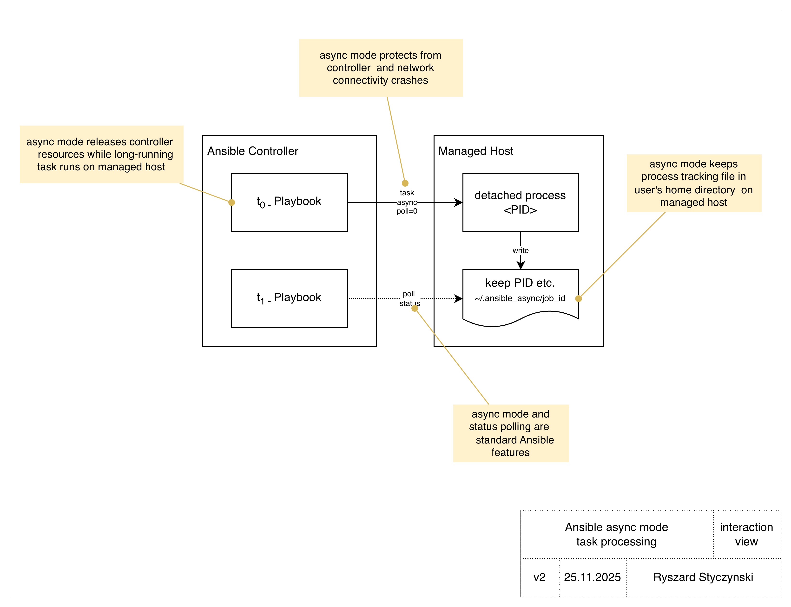

# Ansible Async Mode: Technical Overview

## Introduction

Ansible's asynchronous execution mode allows long-running tasks to execute independently of the controller's SSH connection, protecting operations from network failures and freeing controller resources. This feature is essential for tasks that exceed typical SSH timeout windows (10+ minutes) or when managing multiple long-running operations concurrently. To get more high level information refer to [ansible_async_overview.md](ansible_async_overview.md) introduction document.

The `rstyczynski.ansible` collection provides roles that enhance async functionality with persistent state management, enabling true idempotent long-running task patterns.

## Enhanced Pattern: Persistent State Management with rstyczynski.ansible Collection



### Problem: Job ID Volatility

Ansible's native async mechanism stores job IDs only in playbook run memory. If the controller crashes or the operator forgets the job ID, there's no way to check task status or retrieve results.

### Solution: Named Job Persistence

The `rstyczynski.ansible` collection provides two roles that implement persistent, named job storage:

- **`async_job_save`**: Saves job metadata with a human-readable name
- **`async_job_load`**: Retrieves job metadata by name

This enables idempotent long-running task patterns - run the same playbook multiple times, and it will:

1. Check if job already exists
2. Skip starting if already running
3. Check and report current status

### Architecture

**State Storage Hierarchy:**

```
<host>/<playbook_name>/<job_name>.json
```

- **Host level**: Separates jobs by target host
- **Playbook level**: Prevents collisions between different playbooks
- **Job level**: Named identifier within playbook context

**Storage Backends:**

1. **Filesystem** (default): `.ansible_async_state/` on controller
2. **OCI Object Storage**: Cloud-based persistence for distributed teams

### Core Roles

#### async_job_save

Saves async job metadata with a human-readable name for later retrieval.

**Key Parameters:**
- `async_job_save_playbook_name`: Playbook identifier (default: `{{ ansible_play_name }}`)
- `async_job_save_job_name`: Unique job name
- `async_job_save_ansible_job_id`: Job ID from async task
- `async_job_save_host`: Target host
- `async_job_save_backend`: Storage backend (`filesystem` or `oci`)

**Example:**
```yaml
- name: Save job metadata
  ansible.builtin.include_role:
    name: rstyczynski.ansible.async_job_save
  vars:
    async_job_save_playbook_name: "database_migration"
    async_job_save_job_name: "migrate_prod_db"
    async_job_save_ansible_job_id: "{{ migration_task.ansible_job_id }}"
    async_job_save_host: "{{ inventory_hostname }}"
```

#### async_job_load

Loads previously saved job metadata by name.

**Key Parameters:**
- `async_job_load_playbook_name`: Playbook identifier (must match save)
- `async_job_load_job_name`: Job name to load
- `async_job_load_backend`: Storage backend (`filesystem` or `oci`)

**Output Variables:**
- `async_job_load_found`: Boolean - was job found?
- `async_job_load_ansible_job_id`: Retrieved job ID
- `async_job_load_host`: Host where job is running
- `async_job_load_metadata`: Custom metadata dictionary

**Example:**
```yaml
- name: Load existing job
  ansible.builtin.include_role:
    name: rstyczynski.ansible.async_job_load
  vars:
    async_job_load_playbook_name: "database_migration"
    async_job_load_job_name: "migrate_prod_db"

- name: Check if job exists
  ansible.builtin.debug:
    msg: "Job {{ 'found - checking status' if async_job_load_found else 'not found - will start' }}"
```

## Design Patterns

The collection includes 5 test scenarios demonstrating key design patterns for long-running tasks:

### Pattern 1: Idempotent Job Execution (scenario_01)

**Problem:** Running the same playbook multiple times shouldn't start duplicate jobs.

**Solution:** Check for existing job before starting, reuse if found.

```yaml
# Try to load existing job
- ansible.builtin.include_role:
    name: rstyczynski.ansible.async_job_load
  vars:
    async_job_load_playbook_name: "my_deployment"
    async_job_load_job_name: "deploy_app"

# Start ONLY if not found
- ansible.builtin.shell: "./deploy.sh"
  async: 3600
  poll: 0
  register: new_job
  when: not async_job_load_found

# Save if just started
- ansible.builtin.include_role:
    name: rstyczynski.ansible.async_job_save
  vars:
    async_job_save_playbook_name: "my_deployment"
    async_job_save_job_name: "deploy_app"
    async_job_save_ansible_job_id: "{{ new_job.ansible_job_id }}"
    async_job_save_host: "{{ inventory_hostname }}"
  when: not async_job_load_found

# Check status (works for both new and existing)
- ansible.builtin.async_status:
    jid: "{{ async_job_load_ansible_job_id if async_job_load_found else new_job.ansible_job_id }}"
  register: status
```

**Use Case:** Deployment pipelines that may retry, disaster recovery procedures, operator uncertainty about job state.

**Benefits:**

- Safe to run playbook multiple times
- No duplicate job starts
- Always get current status
- Resume checking after controller restart

**Example:** `scenario_01_idempotent_basic.yml`

---

### Pattern 2: Parameterized Job Management (scenario_02)

**Problem:** Need to run similar jobs with different parameters while tracking each independently.

**Solution:** Use CLI variables to parameterize job name, command, and timeout.

```yaml
vars:
  job_name: "{{ cli_job_name | default('default_job') }}"
  job_command: "{{ cli_command | default('./process.sh') }}"
  job_timeout: "{{ cli_timeout | default(3600) | int }}"
```

**CLI Usage:**
```bash
ansible-playbook scenario_02_parameterized.yml \
  -e "cli_job_name=batch_001" \
  -e "cli_command='./process_data.sh /data/batch1'" \
  -e "cli_timeout=7200"

ansible-playbook scenario_02_parameterized.yml \
  -e "cli_job_name=batch_002" \
  -e "cli_command='./process_data.sh /data/batch2'" \
  -e "cli_timeout=7200"
```

**Use Case:** Batch processing with multiple parallel jobs, parameterized deployment environments, tenant-specific operations.

**Benefits:**
- Single playbook for multiple job variants
- Each job tracked independently
- Parameter values stored in metadata
- Easy to script bulk operations

**Example:** `scenario_02_parameterized.yml`

---

### Pattern 3: Blocking Wait with Retry Loop (scenario_03)

**Problem:** Playbook must wait for job completion before proceeding to next step.

**Solution:** Use native `async_status` with `until`/`retries`/`delay` for blocking wait.

```yaml
- name: Wait for completion with native async_status
  ansible.builtin.async_status:
    jid: "{{ job_id }}"
  register: result
  until: result.finished    # Loop condition
  retries: 15               # Maximum attempts
  delay: 2                  # Seconds between checks
```

**Execution Flow:**

1. Check status
2. If not finished, wait 2 seconds
3. Repeat up to 15 times (30 seconds total)
4. If finished → continue
5. If not finished after 15 retries → fail

**Use Case:** Sequential dependencies (job B needs job A results), deployment gates, health check validation.

**Benefits:**

- Simple Ansible-native pattern
- No custom polling logic
- Clear timeout behavior
- Automatic retry on transient failures

**Example:** `scenario_03_wait_loop.yml`

---

### Pattern 4: Crash Detection and Recovery (scenario_04)

**Problem:** Detect if async job was killed (process crash, OOM, manual termination).

**Solution:** Ansible's async wrapper catches signals and records failure state.

```yaml
- name: Start long task
  ansible.builtin.shell: "sleep 300"
  async: 600
  poll: 0
  register: job

# Later (or after manual kill)...
- name: Check job status
  ansible.builtin.async_status:
    jid: "{{ job.ansible_job_id }}"
  register: check
  ignore_errors: true
```

**Detection Logic:**

```yaml

  SYSTEM CRASH: Results file lost (host reboot/disk full)

  PROCESS KILLED: Terminated with signal (rc=-15 for SIGTERM)

  RUNNING: Job still in progress

  SUCCESS: Completed normally (rc=0)

```

**Crash Types:**

| Type | Scenario | Detection | async_status Result |
|------|----------|-----------|---------------------|
| **Process Killed** | `pkill` or `kill -9` | `rc != 0` + `finished=1` | Returns failure with rc=-15 |
| **System Crash** | Host reboot, disk full | `'could not find job'` | Can't read results file |

**Use Case:** Long-running operations on unreliable hosts, resource-constrained environments, proactive failure handling.

**Benefits:**

- Detect process termination vs. system failure
- Different recovery strategies per failure type
- Ansible async wrapper provides robust tracking
- Results survive process death (but not system crash)

**Example:** `scenario_04_crash_detection.yml`

---

### Pattern 5: Cloud-Based State Persistence (scenario_01_oci)

**Problem:** Controller failure or team handoff breaks job tracking with filesystem storage.

**Solution:** Use OCI Object Storage backend for distributed team access and disaster recovery.

**Architecture:**

```
OCI Bucket: ansible-async-test/
└── localhost/
    └── scenario_01_oci_basic/
        └── oci_test_job.json
```

**Configuration:**

```yaml
- ansible.builtin.include_role:
    name: rstyczynski.ansible.async_job_save
  vars:
    async_job_save_backend: "oci"
    async_job_save_playbook_name: "production_deploy"
    async_job_save_job_name: "deploy_prod"
    async_job_save_oci_bucket: "ansible-state"
    async_job_save_oci_namespace: "{{ oci_namespace }}"
```

**Prerequisites:**

- OCI CLI configured (`oci setup config`)
- OCI bucket created
- IAM permissions for object read/write

**Use Case:** Multi-operator teams, disaster recovery scenarios, controller infrastructure failure, cloud-native deployments.

**Benefits:**

- State survives controller failure
- Multiple operators can check job status
- Geographic redundancy (OCI bucket replication)
- Audit trail in object storage logs
- Team handoff without knowledge loss

**Limitations:**

- Network latency vs. filesystem
- OCI CLI dependency
- Cloud costs (minimal for small state files)

**Example:** `scenario_01_oci_basic.yml`

---

## Complete Idempotent Pattern Example

Here's a production-ready example combining multiple patterns:

```yaml
---
- name: Production deployment with idempotent async pattern
  hosts: production_servers
  gather_facts: true
  vars:
    deployment_name: "{{ deploy_id | default('prod_deploy_001') }}"
    deployment_timeout: 7200  # 2 hours

  tasks:
    # PATTERN 1: Idempotent check
    - name: Check if deployment already running
      ansible.builtin.include_role:
        name: rstyczynski.ansible.async_job_load
      vars:
        async_job_load_playbook_name: "production_deployment"
        async_job_load_job_name: "{{ deployment_name }}"
        async_job_load_backend: "oci"  # PATTERN 5: Cloud persistence
        async_job_load_oci_bucket: "ansible-prod-state"
        async_job_load_oci_namespace: "{{ oci_namespace }}"

    - name: Display deployment status
      ansible.builtin.debug:
        msg: |
          Deployment: {{ deployment_name }}
          Status: {{ 'Already running - will check progress' if async_job_load_found else 'Not found - starting new deployment' }}

    # PATTERN 2: Parameterized execution
    - name: Start deployment (only if not exists)
      ansible.builtin.shell: |
        /opt/deploy/deploy.sh \
          --version {{ app_version }} \
          --environment production \
          --timeout {{ deployment_timeout }}
      async: "{{ deployment_timeout }}"
      poll: 0
      register: deploy_task
      when: not async_job_load_found

    - name: Save deployment state to OCI
      ansible.builtin.include_role:
        name: rstyczynski.ansible.async_job_save
      vars:
        async_job_save_playbook_name: "production_deployment"
        async_job_save_job_name: "{{ deployment_name }}"
        async_job_save_ansible_job_id: "{{ deploy_task.ansible_job_id }}"
        async_job_save_host: "{{ inventory_hostname }}"
        async_job_save_backend: "oci"
        async_job_save_oci_bucket: "ansible-prod-state"
        async_job_save_oci_namespace: "{{ oci_namespace }}"
        async_job_save_metadata:
          app_version: "{{ app_version }}"
          started_by: "{{ ansible_user_id }}"
          timeout: "{{ deployment_timeout }}"
      when: not async_job_load_found

    # PATTERN 3: Optional blocking wait
    - name: Wait for deployment completion
      ansible.builtin.async_status:
        jid: "{{ async_job_load_ansible_job_id if async_job_load_found else deploy_task.ansible_job_id }}"
      register: deploy_status
      until: deploy_status.finished
      retries: 120  # 2 hours with 60s delay
      delay: 60
      ignore_errors: true
      when: wait_for_completion | default(false) | bool

    # PATTERN 4: Status reporting with crash detection
    - name: Report deployment status
      ansible.builtin.debug:
        msg: |
          Deployment: {{ deployment_name }}
          
          Status: SYSTEM CRASH - Results file lost
          
          Status: DEPLOYMENT FAILED - Process terminated (rc={{ deploy_status.rc }})
          
          Status: IN PROGRESS - Run playbook again to check
          
          Status: SUCCESS - Deployment completed
          
      when: deploy_status is defined
```

**Usage Examples:**

```bash
# Start deployment (fire-and-forget)
ansible-playbook production_deploy.yml \
  -e "deploy_id=prod_v2.1.5" \
  -e "app_version=2.1.5"

# Check deployment status (idempotent - safe to run multiple times)
ansible-playbook production_deploy.yml \
  -e "deploy_id=prod_v2.1.5"

# Start and wait for completion
ansible-playbook production_deploy.yml \
  -e "deploy_id=prod_v2.1.6" \
  -e "app_version=2.1.6" \
  -e "wait_for_completion=true"
```

## Storage Backend Comparison

| Feature | Filesystem Backend | OCI Backend |
|---------|-------------------|-------------|
| **Setup Complexity** | None (default) | OCI CLI configuration required |
| **Performance** | Instant (local disk) | Network latency (~100-500ms) |
| **Persistence** | Controller lifetime | Indefinite (cloud storage) |
| **Multi-Operator** | Shared filesystem only | Native multi-user access |
| **Disaster Recovery** | Controller backup required | Built-in redundancy |
| **Cost** | Free (disk space) | OCI storage costs (minimal) |
| **Use Case** | Single operator, local dev | Teams, production, DR |

## Key State File Locations

### Controller (rstyczynski.ansible collection)

**Filesystem Backend:**
```
.ansible_async_state/
└── <host>/
    └── <playbook_name>/
        └── <job_name>.json
```

**Example:** `.ansible_async_state/localhost/production_deployment/deploy_prod.json`

**OCI Backend:**

```
oci://<bucket>/
└── <host>/
    └── <playbook_name>/
        └── <job_name>.json
```

**Example:** `oci://ansible-prod-state/localhost/production_deployment/deploy_prod.json`

### Managed Host (Ansible native)

**Location:** `~/.ansible_async/<job_id>` on target host

**Example:** `~/.ansible_async/j889214147243.9938`

**Contents:** Full task execution results (stdout, stderr, rc, timing)

**Relationship:**

```
Controller State File          Managed Host Results File
.ansible_async_state/          ~/.ansible_async/
  localhost/                     j889214147243.9938
    my_playbook/                 ↑
      deploy_job.json            |
        └─ ansible_job_id ───────┘
```

## Migration from Native Async Pattern

### Before (Native Ansible - No Persistence)

```yaml
# First playbook run - start job
- name: Start migration
  ansible.builtin.shell: "/opt/migrate.sh"
  async: 43200
  poll: 0
  register: job

# Problem: If playbook ends, job_id is lost!
# No way to check status later without remembering job_id
```

### After (With rstyczynski.ansible Collection)

```yaml
# First run - start and save
- ansible.builtin.include_role:
    name: rstyczynski.ansible.async_job_load
  vars:
    async_job_load_playbook_name: "migration"
    async_job_load_job_name: "migrate_2024"

- ansible.builtin.shell: "/opt/migrate.sh"
  async: 43200
  poll: 0
  register: job
  when: not async_job_load_found

- ansible.builtin.include_role:
    name: rstyczynski.ansible.async_job_save
  vars:
    async_job_save_playbook_name: "migration"
    async_job_save_job_name: "migrate_2024"
    async_job_save_ansible_job_id: "{{ job.ansible_job_id }}"
    async_job_save_host: "{{ inventory_hostname }}"
  when: not async_job_load_found

# Second run (hours/days later) - automatically loads job_id
# Can run same playbook to check status - fully idempotent!
```

## Best Practices

### Job Naming

✅ **Good:**
- Use descriptive names: `"prod_db_migration_v2.1"`
- Include version/date: `"deploy_{{ ansible_date_time.date }}"`
- Environment-specific: `"backup_{{ environment }}_{{ timestamp }}"`

❌ **Avoid:**

- Generic names: `"job1"`, `"task"`
- No context: `"test"`
- Reusing names across different operations

### Playbook Name Selection

The `playbook_name` parameter prevents collisions when multiple playbooks use the same `job_name`.

**Default Behavior:** Uses `{{ ansible_play_name }}` (the play name from YAML)

**When to Override:**

- Multiple playbooks managing same logical operation
- Need explicit control over state file hierarchy
- Migrating from old state file structure

**Example:**

```yaml
# Explicit playbook_name for clarity
async_job_save_playbook_name: "database_maintenance"
async_job_save_job_name: "vacuum_full"

# Results in: .ansible_async_state/localhost/database_maintenance/vacuum_full.json
```

### Error Handling

Always use `ignore_errors: true` with `async_status` to handle completed/killed jobs gracefully:

```yaml
- ansible.builtin.async_status:
    jid: "{{ job_id }}"
  register: status
  ignore_errors: true  # Don't fail on completed or killed jobs

- name: Handle different outcomes
  ansible.builtin.debug:
    msg: "{{ 'Job failed' if status.failed else 'Job succeeded' }}"
```

### Metadata Usage

Store operational context in metadata for troubleshooting:

```yaml
async_job_save_metadata:
  operator: "{{ ansible_user_id }}"
  ticket: "OPS-12345"
  environment: "production"
  start_time: "{{ ansible_date_time.iso8601 }}"
  command: "{{ job_command }}"
```

## Troubleshooting

### Job Not Found After Controller Restart

**Symptom:** `async_job_load_found: false` for known running job

**Cause:** Filesystem backend lost (controller rebuilt, disk wiped)

**Solution:** Migrate to OCI backend for production use

### Undefined Variable Error

**Symptom:** `'async_job_load_playbook_name' is undefined`

**Cause:** Updated to version with BF-1 fix (Sprint 13) without updating playbooks

**Solution:** Add `playbook_name` parameter to all save/load operations:

```yaml
async_job_save_playbook_name: "your_playbook_name"
async_job_load_playbook_name: "your_playbook_name"
```

### Multiple Playbooks Overwriting State

**Symptom:** Job state files getting overwritten unexpectedly

**Cause:** Multiple playbooks using same `job_name` without unique `playbook_name`

**Solution:** Use different `playbook_name` for each playbook:

```yaml
# Playbook A
async_job_save_playbook_name: "deployment_app1"
async_job_save_job_name: "deploy"

# Playbook B
async_job_save_playbook_name: "deployment_app2"
async_job_save_job_name: "deploy"  # Same job_name OK with different playbook_name
```

### OCI CLI Authentication Failure

**Symptom:** `oci os object put` command fails

**Solution:** Verify OCI CLI configuration:

```bash
oci setup config      # Configure if not done
oci os ns get         # Test authentication
oci iam region list   # Verify profile works
```

### Job Results File Not Found on Managed Host

**Symptom:** `async_status` returns "could not find job"

**Possible Causes:**

1. Host rebooted (results file lost)
2. `~/.ansible_async/` directory cleared
3. Wrong job ID (typo or loaded from wrong state)
4. Job completed and results cleaned up

**Solution:** Check host uptime, verify `~/.ansible_async/` exists, confirm job ID matches

## Limitations

### Ansible Native Async

- Task output buffered in memory on managed host
- Requires sufficient disk space in `async_dir`
- No progress reporting during execution
- Callback plugins don't receive intermediate updates
- Results file survives process death but not managed host crash

## References

### Ansible Official Documentation
- [Asynchronous Actions and Polling](https://docs.ansible.com/ansible/latest/playbook_guide/playbooks_async.html)
- [async_status Module](https://docs.ansible.com/ansible/latest/collections/ansible/builtin/async_status_module.html)
- [async_dir Configuration](https://docs.ansible.com/ansible/latest/reference_appendices/config.html#async-dir)

### rstyczynski.ansible Collection
- Collection README: `ansible_collection/collections/ansible_collections/rstyczynski/ansible/README.md`
- Role Documentation:
  - `async_job_save`: `ansible-doc -t role rstyczynski.ansible.async_job_save`
  - `async_job_load`: `ansible-doc -t role rstyczynski.ansible.async_job_load`

### Example Scenarios

- `scenario_01_idempotent_basic.yml` - Idempotent pattern
- `scenario_02_parameterized.yml` - Parameterized jobs
- `scenario_03_wait_loop.yml` - Blocking wait pattern
- `scenario_04_crash_detection.yml` - Crash detection
- `scenario_01_oci_basic.yml` - OCI backend usage
