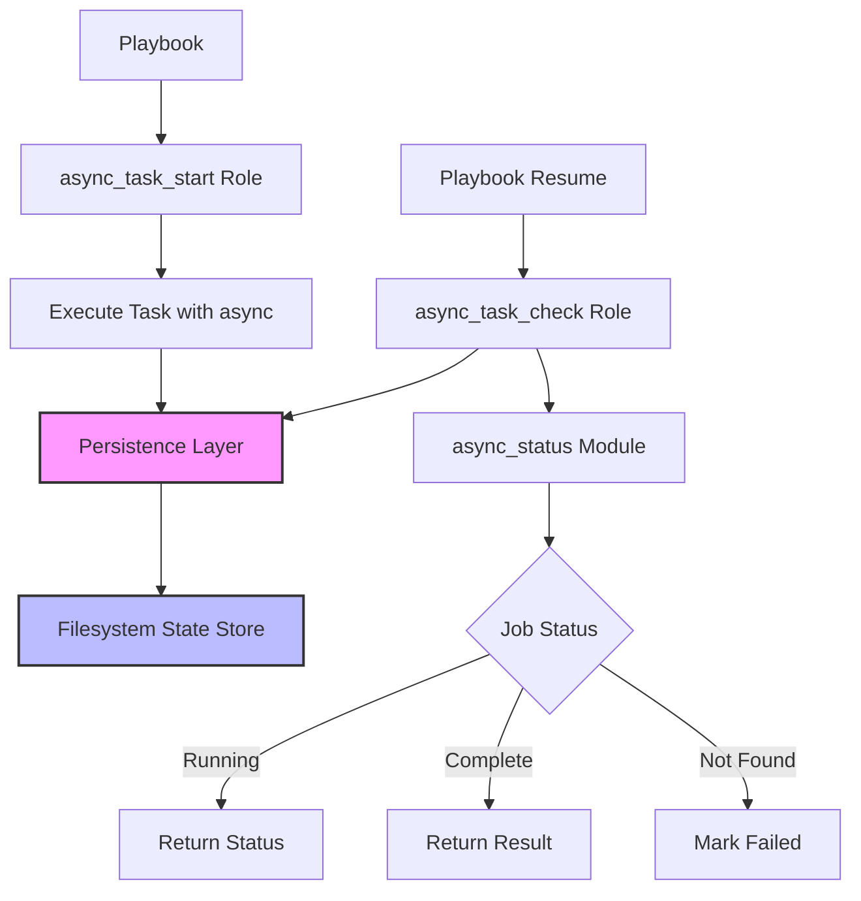

# Sprint 11 - Design

## GHC-15: Long running task

Status: Accepted

### Requirement Summary

Create a new Ansible Collection (`rstyczynski.ansible`) with infrastructure for handling long-running asynchronous tasks. The solution must:
- Execute tasks asynchronously using Ansible's native `async` capabilities
- Persist job state to allow playbook exit and resume
- Support multiple test scenarios (wait, exit-resume, host crash)
- Use filesystem-based persistence (with extension points for Ara/S3)

### Feasibility Analysis

**API Availability:**
All required Ansible APIs are available and well-documented:

1. **ansible.builtin.command / ansible.builtin.shell** with `async` and `poll` parameters
   - Reference: https://docs.ansible.com/ansible/latest/playbook_guide/playbooks_async.html
   - Status: ✅ Available in all Ansible versions
   - Capability: Launch tasks asynchronously, return job ID

2. **ansible.builtin.async_status** module
   - Reference: https://docs.ansible.com/ansible/latest/collections/ansible/builtin/async_status_module.html
   - Status: ✅ Available in all Ansible versions
   - Capability: Check status of async jobs, retrieve results

3. **ansible.builtin.stat** module
   - Reference: https://docs.ansible.com/ansible/latest/collections/ansible/builtin/stat_module.html
   - Status: ✅ Available
   - Capability: Check if state files exist

4. **ansible.builtin.file** module
   - Reference: https://docs.ansible.com/ansible/latest/collections/ansible/builtin/file_module.html
   - Status: ✅ Available
   - Capability: Create directories, manage file permissions

5. **ansible.builtin.copy** module with `content` parameter
   - Reference: https://docs.ansible.com/ansible/latest/collections/ansible/builtin/copy_module.html
   - Status: ✅ Available
   - Capability: Write JSON/YAML state files atomically

6. **ansible.builtin.slurp** module
   - Reference: https://docs.ansible.com/ansible/latest/collections/ansible/builtin/slurp_module.html
   - Status: ✅ Available
   - Capability: Read state files, parse JSON

**Technical Constraints:**

1. **Async Job IDs are Host-Specific**: Ansible async job IDs are only valid on the host where the task was started
   - Mitigation: Persist job ID with host identifier
   - Impact: State management must track host association

2. **Job ID Validity**: Async job IDs become invalid if:
   - Host reboots
   - Ansible tmp directory is cleared
   - Process is killed (host crash scenario)
   - Mitigation: Detect "job not found" errors and mark as failed

3. **Filesystem Permissions**: State files must be readable/writable by playbook executor
   - Mitigation: Create state directory with appropriate permissions
   - Use `mode: '0700'` for state directory, `mode: '0600'` for state files

4. **Concurrent Access**: Multiple playbooks could write to same state directory
   - Mitigation: Use unique job identifiers, atomic file writes
   - Acceptable risk for initial implementation (document limitation)

**Risk Assessment:**

- **Risk 1: State File Corruption**
  - Probability: Low
  - Impact: Medium (job state lost)
  - Mitigation: Use ansible.builtin.copy with atomic writes, JSON validation on read

- **Risk 2: Host Crash Detection Ambiguity**
  - Probability: Medium
  - Impact: Low (false positives possible)
  - Mitigation: Use timeout + async_status failure as crash indicators, document behavior

- **Risk 3: Concurrent Playbook Conflicts**
  - Probability: Low (for typical use)
  - Impact: Low (worst case: duplicate job records)
  - Mitigation: Unique job IDs, document concurrent access limitations

- **Risk 4: State Directory Growth**
  - Probability: High (over time)
  - Impact: Low-Medium (disk space)
  - Mitigation: Provide cleanup utility role, document TTL recommendations

**Feasibility Conclusion:** ✅ All requirements are technically feasible using native Ansible capabilities.

### Design Overview

**Architecture:**



**Key Components:**

1. **Collection Structure** (`rstyczynski.ansible`)
   - Purpose: Container for general-purpose Ansible utilities
   - Location: `ansible_collection/collections/ansible_collections/rstyczynski/ansible/`
   - Components: roles/, plugins/, docs/, README.md, galaxy.yml

2. **async_task_start Role**
   - Purpose: Launch async tasks and persist job state
   - Responsibilities:
     - Execute task with async/poll
     - Generate unique job ID
     - Store job metadata to filesystem
     - Return job ID and initial status

3. **async_task_check Role**
   - Purpose: Check status of previously started async tasks
   - Responsibilities:
     - Load job state from filesystem
     - Query async_status for current state
     - Update state file with results
     - Handle "job not found" errors (host crash detection)

4. **async_task_cleanup Role** (optional, time permitting)
   - Purpose: Clean up old job state files
   - Responsibilities:
     - Remove completed jobs older than TTL
     - List all stored jobs
     - Purge all state (for testing)

5. **Persistence Layer** (Filesystem Implementation)
   - Purpose: Store and retrieve job state
   - Implementation: JSON files in `.ansible_async_state/` directory
   - Schema: See "Data Structures" section below

**Data Flow:**

1. **Starting Async Task:**
   ```
   Playbook → async_task_start role
   → Execute task (async, poll=0)
   → Generate job record
   → Write to .ansible_async_state/<job_id>.json
   → Return job_id to playbook
   ```

2. **Checking Async Task:**
   ```
   Playbook → async_task_check role (with job_id)
   → Read .ansible_async_state/<job_id>.json
   → Call async_status on target host
   → Update state file with current status
   → Return status and result to playbook
   ```

3. **Host Crash Scenario:**
   ```
   Playbook → async_task_check role (with job_id)
   → Read state file
   → Call async_status → FAILURE (job not found)
   → Update state file: status='failed', error='host_crash_suspected'
   → Return failure to playbook
   ```

### Technical Specification

**APIs Used:**

1. **ansible.builtin.command (with async)**
   - Method: Execute arbitrary command asynchronously
   - Parameters: `async: <seconds>`, `poll: 0`, command to execute
   - Purpose: Start long-running tasks
   - Returns: `ansible_job_id`, `started: 1`
   - Documentation: https://docs.ansible.com/ansible/latest/playbook_guide/playbooks_async.html

2. **ansible.builtin.async_status**
   - Method: Check async job status
   - Parameters: `jid: <ansible_job_id>`
   - Purpose: Poll job status, retrieve results
   - Returns: `finished: 0|1`, `started: 1`, result data
   - Documentation: https://docs.ansible.com/ansible/latest/collections/ansible/builtin/async_status_module.html

3. **ansible.builtin.copy (for atomic writes)**
   - Method: Write state files atomically
   - Parameters: `content: <json>`, `dest: <path>`, `mode: '0600'`
   - Purpose: Persist job state safely
   - Documentation: https://docs.ansible.com/ansible/latest/collections/ansible/builtin/copy_module.html

4. **ansible.builtin.slurp (for reading state)**
   - Method: Read file content (base64 encoded)
   - Parameters: `src: <path>`
   - Purpose: Load job state
   - Returns: Encoded file content
   - Documentation: https://docs.ansible.com/ansible/latest/collections/ansible/builtin/slurp_module.html

**Data Structures:**

**Job State File (`<job_id>.json`):**
```json
{
  "job_id": "playbook_1732450800_a1b2c3d4",
  "playbook_name": "long_running_flow",
  "play_id": "play_1732450800_e5f6g7h8",
  "host": "managed_host_1",
  "task_name": "Long running data processing",
  "command": "sleep 30",
  "ansible_job_id": "123456.789",
  "status": "running",
  "start_time": "2025-11-24T15:30:00Z",
  "check_time": "2025-11-24T15:30:05Z",
  "finish_time": null,
  "result": null,
  "error": null,
  "timeout": 300,
  "metadata": {
    "tags": ["data-processing", "batch-job"],
    "owner": "ansible_user"
  }
}
```

**Status Field Values:**
- `running`: Task is executing
- `completed`: Task finished successfully
- `failed`: Task failed or host crash detected
- `timeout`: Task exceeded timeout threshold
- `unknown`: State unclear (requires investigation)

**Argument Specifications:**

**async_task_start role** (`meta/argument_specs.yml`):
```yaml
---
argument_specs:
  main:
    short_description: Start asynchronous task with state persistence

    options:
      # INPUTS
      async_task_start_command:
        description: "Command or script to execute asynchronously"
        type: str
        required: true

      async_task_start_task_name:
        description: "Human-readable name for this task"
        type: str
        required: true

      async_task_start_timeout:
        description: "Maximum execution time in seconds"
        type: int
        default: 300

      async_task_start_playbook_name:
        description: "Name of playbook executing this task"
        type: str
        default: "{{ ansible_play_name | default('unknown') }}"

      async_task_start_state_dir:
        description: "Directory to store job state files"
        type: str
        default: ".ansible_async_state"

      async_task_start_metadata:
        description: "Optional metadata dictionary for job tagging"
        type: dict
        required: false
        default: {}

      # OUTPUTS
      async_task_start_job_id:
        description: "[OUTPUT] Unique job identifier for this task"
        type: str
        required: false

      async_task_start_ansible_job_id:
        description: "[OUTPUT] Ansible's internal async job ID"
        type: str
        required: false

      async_task_start_status:
        description: "[OUTPUT] Initial task status (always 'running')"
        type: str
        required: false

      async_task_start_state_file:
        description: "[OUTPUT] Full path to job state file"
        type: str
        required: false
```

**async_task_check role** (`meta/argument_specs.yml`):
```yaml
---
argument_specs:
  main:
    short_description: Check status of asynchronous task

    options:
      # INPUTS
      async_task_check_job_id:
        description: "Job ID returned by async_task_start"
        type: str
        required: true

      async_task_check_state_dir:
        description: "Directory containing job state files"
        type: str
        default: ".ansible_async_state"

      async_task_check_fail_on_timeout:
        description: "Fail role if task has timed out"
        type: bool
        default: true

      async_task_check_mark_crash:
        description: "Mark job as failed if async_status reports 'not found'"
        type: bool
        default: true

      # OUTPUTS
      async_task_check_status:
        description: "[OUTPUT] Current task status: running, completed, failed, timeout"
        type: str
        required: false

      async_task_check_finished:
        description: "[OUTPUT] Boolean indicating if task is done"
        type: bool
        required: false

      async_task_check_result:
        description: "[OUTPUT] Task result data (if completed)"
        type: dict
        required: false

      async_task_check_error:
        description: "[OUTPUT] Error message (if failed)"
        type: str
        required: false
```

**Directory Structure:**

```
ansible_collection/
├── collections/
│   └── ansible_collections/
│       └── rstyczynski/
│           └── ansible/
│               ├── galaxy.yml
│               ├── README.md
│               ├── roles/
│               │   ├── async_task_start/
│               │   │   ├── meta/
│               │   │   │   └── argument_specs.yml
│               │   │   ├── tasks/
│               │   │   │   └── main.yml
│               │   │   ├── defaults/
│               │   │   │   └── main.yml
│               │   │   └── README.md
│               │   ├── async_task_check/
│               │   │   ├── meta/
│               │   │   │   └── argument_specs.yml
│               │   │   ├── tasks/
│               │   │   │   └── main.yml
│               │   │   ├── defaults/
│               │   │   │   └── main.yml
│               │   │   └── README.md
│               │   └── async_task_cleanup/
│               │       ├── meta/
│               │       │   └── argument_specs.yml
│               │       ├── tasks/
│               │       │   └── main.yml
│               │       └── README.md
│               └── docs/
│                   └── async_tasks_guide.md
├── long_running_flow.yml
└── .ansible_async_state/
    └── (job state files created at runtime)
```

**Error Handling:**

1. **State Directory Creation Failure**
   - Detection: file module fails to create `.ansible_async_state/`
   - Handling: Fail role with clear error message
   - Recovery: User checks permissions, fixes, re-runs

2. **Async Task Start Failure**
   - Detection: Command module fails immediately
   - Handling: Don't create state file, fail role with command error
   - Recovery: User fixes command, re-runs

3. **State File Write Failure**
   - Detection: copy module fails
   - Handling: Task started but state not persisted (warning logged)
   - Recovery: Best effort - job runs but can't be tracked

4. **State File Read Failure (file not found)**
   - Detection: slurp fails, file doesn't exist
   - Handling: Fail role with "job ID not found" error
   - Recovery: User verifies job_id, checks state directory

5. **State File Read Failure (corrupted JSON)**
   - Detection: from_json filter fails
   - Handling: Fail role with "corrupted state file" error
   - Recovery: User inspects/repairs JSON file or deletes it

6. **async_status Reports "Job Not Found"**
   - Detection: async_status module returns error about missing job ID
   - Handling: Update state file with status='failed', error='host_crash_suspected'
   - Recovery: Job is lost, mark as failed, user investigates host

7. **Task Timeout**
   - Detection: Current time - start_time > timeout threshold
   - Handling: Mark job as status='timeout' in state file
   - Recovery: User increases timeout or investigates slow task

8. **Connection Failure During Check**
   - Detection: async_status fails with connection error
   - Handling: Don't update state, return last known status with warning
   - Recovery: Retry check when host is reachable

### Implementation Approach

**Phase 1: Collection Initialization (Step 1-3)**

**Step 1:** Create collection directory structure
- Create `ansible_collection/collections/ansible_collections/rstyczynski/ansible/`
- Create subdirectories: roles/, docs/
- Initialize `.gitkeep` files where needed

**Step 2:** Create `galaxy.yml`
- Namespace: `rstyczynski`
- Name: `ansible`
- Version: `1.0.0`
- Description: "General-purpose Ansible utilities for operational automation"
- Tags: ansible, async, utilities, operations
- Dependencies: none
- Repository: https://github.com/rstyczynski/ansible-tricks
- Documentation: relative path to README

**Step 3:** Create collection README.md
- Overview of collection purpose
- List of roles (async_task_start, async_task_check, async_task_cleanup)
- Installation instructions (local development mode)
- Quick start example
- Links to role documentation

**Phase 2: async_task_start Role (Steps 4-8)**

**Step 4:** Create role structure
- `roles/async_task_start/{meta,tasks,defaults,README.md}`
- Create `argument_specs.yml` with full specification (see Data Structures section)

**Step 5:** Implement `tasks/main.yml` - State Directory Setup
```yaml
- name: "Async Start: Ensure state directory exists"
  ansible.builtin.file:
    path: "{{ async_task_start_state_dir }}"
    state: directory
    mode: '0700'
  delegate_to: localhost
  run_once: true
```

**Step 6:** Implement `tasks/main.yml` - Generate Job ID
```yaml
- name: "Async Start: Generate unique job ID"
  ansible.builtin.set_fact:
    async_task_start_job_id: "{{ async_task_start_playbook_name }}_{{ ansible_date_time.epoch }}_{{ 99999999 | random | to_uuid | hash('md5') | truncate(8, True, '') }}"
    async_task_start_start_time: "{{ ansible_date_time.iso8601 }}"
```

**Step 7:** Implement `tasks/main.yml` - Execute Async Task
```yaml
- name: "Async Start: Execute command asynchronously"
  ansible.builtin.shell: "{{ async_task_start_command }}"
  async: "{{ async_task_start_timeout }}"
  poll: 0
  register: async_task_start_async_result

- name: "Async Start: Capture ansible job ID"
  ansible.builtin.set_fact:
    async_task_start_ansible_job_id: "{{ async_task_start_async_result.ansible_job_id }}"
    async_task_start_status: "running"
    async_task_start_state_file: "{{ async_task_start_state_dir }}/{{ async_task_start_job_id }}.json"
```

**Step 8:** Implement `tasks/main.yml` - Persist State
```yaml
- name: "Async Start: Write job state to file"
  ansible.builtin.copy:
    content: |
      {
        "job_id": "{{ async_task_start_job_id }}",
        "playbook_name": "{{ async_task_start_playbook_name }}",
        "host": "{{ inventory_hostname }}",
        "task_name": "{{ async_task_start_task_name }}",
        "command": "{{ async_task_start_command }}",
        "ansible_job_id": "{{ async_task_start_ansible_job_id }}",
        "status": "running",
        "start_time": "{{ async_task_start_start_time }}",
        "timeout": {{ async_task_start_timeout }},
        "metadata": {{ async_task_start_metadata | to_json }}
      }
    dest: "{{ async_task_start_state_file }}"
    mode: '0600'
  delegate_to: localhost
```

**Phase 3: async_task_check Role (Steps 9-13)**

**Step 9:** Create role structure
- `roles/async_task_check/{meta,tasks,defaults,README.md}`
- Create `argument_specs.yml` with full specification

**Step 10:** Implement `tasks/main.yml` - Load State
```yaml
- name: "Async Check: Load job state file"
  ansible.builtin.slurp:
    src: "{{ async_task_check_state_dir }}/{{ async_task_check_job_id }}.json"
  register: async_task_check_state_raw
  delegate_to: localhost

- name: "Async Check: Parse job state"
  ansible.builtin.set_fact:
    async_task_check_job_state: "{{ async_task_check_state_raw.content | b64decode | from_json }}"
```

**Step 11:** Implement `tasks/main.yml` - Check Async Status
```yaml
- name: "Async Check: Query async_status"
  ansible.builtin.async_status:
    jid: "{{ async_task_check_job_state.ansible_job_id }}"
  register: async_task_check_async_result
  ignore_errors: true
  delegate_to: "{{ async_task_check_job_state.host }}"
```

**Step 12:** Implement `tasks/main.yml` - Determine Status
```yaml
- name: "Async Check: Determine final status"
  ansible.builtin.set_fact:
    async_task_check_status: >-
      
      failed
      
      completed
      
      failed
      
      running
      
    async_task_check_finished: "{{ async_task_check_async_result.finished | default(0) == 1 }}"
    async_task_check_result: "{{ async_task_check_async_result if async_task_check_async_result.finished == 1 else {} }}"
    async_task_check_error: "{{ async_task_check_async_result.msg | default('') if async_task_check_async_result.failed else '' }}"
```

**Step 13:** Implement `tasks/main.yml` - Update State File
```yaml
- name: "Async Check: Update job state file"
  ansible.builtin.copy:
    content: |
      {{
        async_task_check_job_state | combine({
          'status': async_task_check_status,
          'check_time': ansible_date_time.iso8601,
          'finish_time': (ansible_date_time.iso8601 if async_task_check_finished else null),
          'result': (async_task_check_result | to_json if async_task_check_finished else null),
          'error': async_task_check_error
        }) | to_nice_json
      }}
    dest: "{{ async_task_check_state_dir }}/{{ async_task_check_job_id }}.json"
    mode: '0600'
  delegate_to: localhost
```

**Phase 4: Test Playbook (Steps 14-17)**

**Step 14:** Create `long_running_flow.yml` - Test 1 (Wait)
```yaml
---
- name: Test 1 - Controller waits for result
  hosts: localhost
  gather_facts: true
  tasks:
    - name: Start async task
      ansible.builtin.include_role:
        name: rstyczynski.ansible.async_task_start
      vars:
        async_task_start_command: "sleep 10"
        async_task_start_task_name: "Test sleep 10 seconds"
        async_task_start_timeout: 30

    - name: Wait and check until complete
      ansible.builtin.include_role:
        name: rstyczynski.ansible.async_task_check
      vars:
        async_task_check_job_id: "{{ async_task_start_job_id }}"
      until: async_task_check_finished
      retries: 10
      delay: 2

    - name: Display result
      ansible.builtin.debug:
        msg: "Task completed with status: {{ async_task_check_status }}"
```

**Step 15:** Create `long_running_flow.yml` - Test 2 (Exit)
```yaml
---
- name: Test 2 - Controller exits after invocation
  hosts: localhost
  gather_facts: true
  tasks:
    - name: Start async task
      ansible.builtin.include_role:
        name: rstyczynski.ansible.async_task_start
      vars:
        async_task_start_command: "sleep 60"
        async_task_start_task_name: "Long task - exit test"
        async_task_start_timeout: 120

    - name: Display job ID for resume
      ansible.builtin.debug:
        msg: "Job started with ID: {{ async_task_start_job_id }}. Use this ID to check status later."
    # Playbook exits here, task continues running
```

**Step 16:** Create `long_running_flow.yml` - Test 3 (Resume)
```yaml
---
- name: Test 3 - Controller resumes and checks
  hosts: localhost
  gather_facts: true
  vars_prompt:
    - name: resume_job_id
      prompt: "Enter job ID to check"
      private: false
  tasks:
    - name: Check job status
      ansible.builtin.include_role:
        name: rstyczynski.ansible.async_task_check
      vars:
        async_task_check_job_id: "{{ resume_job_id }}"

    - name: Display status
      ansible.builtin.debug:
        msg: "Job {{ resume_job_id }} status: {{ async_task_check_status }}, finished: {{ async_task_check_finished }}"

    - name: Exit cleanly if done
      ansible.builtin.debug:
        msg: "Job complete!"
      when: async_task_check_finished
```

**Step 17:** Create `long_running_flow.yml` - Test 4 (Host Crash)
```yaml
---
- name: Test 4 - Host crash handling
  hosts: test_container
  gather_facts: true
  tasks:
    - name: Start async task
      ansible.builtin.include_role:
        name: rstyczynski.ansible.async_task_start
      vars:
        async_task_start_command: "sleep 300"
        async_task_start_task_name: "Task for crash test"

    - name: Record job ID
      ansible.builtin.set_fact:
        crash_test_job_id: "{{ async_task_start_job_id }}"
      delegate_to: localhost

# Manual step: Stop container here (podman stop test_container)

- name: Check job after crash
  hosts: localhost
  tasks:
    - name: Attempt to check crashed job
      ansible.builtin.include_role:
        name: rstyczynski.ansible.async_task_check
      vars:
        async_task_check_job_id: "{{ hostvars['test_container']['crash_test_job_id'] }}"
      ignore_errors: true

    - name: Verify crash detected
      ansible.builtin.assert:
        that:
          - async_task_check_status == "failed"
          - "'host_crash' in async_task_check_error or 'could not find job' in async_task_check_error"
        success_msg: "Crash correctly detected and handled"
        fail_msg: "Crash detection failed"
```

**Phase 5: Testing Infrastructure (Steps 18-19)**

**Step 18:** Create Podman test container setup script
```bash
#!/bin/bash
# File: ansible_collection/setup_test_container.sh
podman run -d --name test_container \
  -v $(pwd):/workspace:Z \
  -e ANSIBLE_STDOUT_CALLBACK=yaml \
  docker.io/library/python:3.11 \
  sleep infinity
```

**Step 19:** Create test execution script
```bash
#!/bin/bash
# File: ansible_collection/run_tests.sh

echo "Setting up test container..."
./setup_test_container.sh

echo "Running Test 1: Wait for result"
ansible-playbook long_running_flow.yml --tags test1

echo "Running Test 2: Exit after start"
ansible-playbook long_running_flow.yml --tags test2
JOB_ID=$(cat .ansible_async_state/*.json | jq -r '.job_id' | tail -1)

echo "Running Test 3: Resume with JOB_ID=$JOB_ID"
echo "$JOB_ID" | ansible-playbook long_running_flow.yml --tags test3

echo "Running Test 4: Host crash"
ansible-playbook long_running_flow.yml --tags test4_start
podman stop test_container
ansible-playbook long_running_flow.yml --tags test4_check

echo "Cleanup"
podman rm -f test_container
```

### Testing Strategy

**Functional Tests:**

1. **Test 1: Controller Waits for Result**
   - Purpose: Verify basic async + check + wait loop
   - Execution: Start 10-second sleep, poll every 2 seconds, verify completion
   - Success Criteria:
     - Task completes successfully
     - Status transitions: running → completed
     - Result captured in state file and output variable
     - State file contains accurate timestamps

2. **Test 2: Controller Exits After Invocation**
   - Purpose: Verify async task persists after playbook exit
   - Execution: Start 60-second sleep, capture job_id, playbook exits
   - Success Criteria:
     - Playbook exits immediately (< 5 seconds)
     - Job ID displayed to user
     - State file exists with status='running'
     - Task continues running on host (verify with ps/top)

3. **Test 3: Controller Resumes and Checks Result**
   - Purpose: Verify resume capability with job_id
   - Execution: Use job_id from Test 2, check status, display result
   - Success Criteria:
     - State file successfully loaded
     - async_status correctly queries running/completed job
     - Multiple resume attempts work (idempotent checks)
     - Final check shows completed status and result

4. **Test 4: Managed Host Crashes**
   - Purpose: Verify graceful handling of "job not found" scenario
   - Execution: Start task in container, stop container, attempt check
   - Success Criteria:
     - async_status fails with "could not find job" message
     - Check role detects failure and marks status='failed'
     - Error message contains 'host_crash_suspected' or similar
     - State file updated with failure info
     - Playbook doesn't hang or produce unclear errors

**Edge Cases:**

1. **Concurrent Job Starts**
   - Test: Start multiple async tasks simultaneously
   - Expected: Unique job IDs, all state files created
   - Verify: No file collisions, all jobs tracked independently

2. **State Directory Doesn't Exist**
   - Test: Delete `.ansible_async_state/` before start
   - Expected: Directory auto-created with correct permissions
   - Verify: No errors, directory mode is 0700

3. **Corrupted State File**
   - Test: Manually corrupt JSON in state file, attempt check
   - Expected: Check role fails with clear "corrupted state file" error
   - Verify: Error message helpful for debugging

4. **Job Timeout**
   - Test: Start task with timeout=5, command=sleep 60
   - Expected: Status remains 'running', timeout threshold exceeded
   - Verify: User can detect timeout condition (check_time - start_time > timeout)

5. **Very Short Tasks (< 1 second)**
   - Test: async_task_start with command=true (instant completion)
   - Expected: Task completes before check, state shows completed
   - Verify: Works correctly, no race conditions

**Success Criteria:**

Sprint 11 implementation succeeds if:
- ✅ All 4 functional tests pass
- ✅ Collection structure follows Ansible conventions
- ✅ Both roles have complete argument_specs.yml
- ✅ State persistence works reliably (filesystem)
- ✅ async_status correctly queried on target hosts
- ✅ Host crash detected and marked as failure
- ✅ Documentation includes copy-paste examples
- ✅ No ansible-lint errors in role tasks
- ✅ galaxy.yml is valid and complete
- ✅ README files exist for collection and both roles

### Integration Notes

**Dependencies:**

1. **No external Ansible collections required** - uses only `ansible.builtin` modules
2. **No Python packages required** - pure Ansible implementation
3. **No system utilities required** - beyond Ansible core (sh/bash)
4. **Optional: Podman** - for Test 4 (host crash scenario), but not required for core functionality

**Compatibility:**

**With Existing Collections:**
- Independent from `rstyczynski.github` collection
- Can be used together in playbooks without conflicts
- Both collections installed in same `ansible_collections/rstyczynski/` namespace
- No shared dependencies or resource conflicts

**With Ara Integration (Sprint 8):**
- Ara environment variables don't interfere with async task roles
- Ara callback tracks async task start/check as regular Ansible tasks
- Potential future enhancement: Use Ara REST API as alternate persistence backend
- Current design: Filesystem persistence is primary, Ara is complementary audit trail

**With Previous Sprint Patterns:**
- Follows same argument specification pattern (input/output prefixing)
- Uses `meta/argument_specs.yml` like GitHub collection roles
- Variable prefixing: `async_task_start_*`, `async_task_check_*`
- FQCN in collection name: `rstyczynski.ansible.async_task_start`
- Documentation structure matches GitHub collection README format

**Playbook Integration Example:**
```yaml
---
- name: Combined workflow - GitHub PR + Long-Running Task
  hosts: localhost
  tasks:
    # GitHub operations (existing collection)
    - name: Clone repository
      ansible.builtin.include_role:
        name: rstyczynski.github.repo_clone
      vars:
        repo_clone_repo_url: "https://github.com/user/repo.git"
        repo_clone_dest_path: "./work_repo"

    # Long-running task (new collection)
    - name: Start async data processing
      ansible.builtin.include_role:
        name: rstyczynski.ansible.async_task_start
      vars:
        async_task_start_command: "./work_repo/scripts/process_data.sh"
        async_task_start_task_name: "Data processing job"
        async_task_start_timeout: 3600

    # More GitHub operations while task runs
    - name: Create pull request
      ansible.builtin.include_role:
        name: rstyczynski.github.pr_create
      vars:
        pr_create_dest_path: "./work_repo"
        pr_create_pr_title: "Automated data update"
```

**Reusability:**

1. **Collection Structure**: Template for future `rstyczynski.ansible` utility roles
2. **Persistence Layer**: Filesystem pattern reusable for other state tracking needs
3. **Job ID Generation**: UUID pattern applicable to other unique identifier needs
4. **Error Handling**: Host crash detection pattern useful for other connection-dependent operations
5. **Test Container Setup**: Podman scripts reusable for testing other roles

### Documentation Requirements

**User Documentation:**

1. **Collection README (`ansible_collection/collections/ansible_collections/rstyczynski/ansible/README.md`)**
   - Collection overview and purpose
   - Installation instructions (local development path)
   - Quick start with simple example
   - List of roles with brief descriptions
   - Link to detailed role documentation

2. **async_task_start Role README**
   - Purpose and use cases
   - Prerequisites (Ansible version, no external deps)
   - Complete argument specification table (inputs and outputs)
   - Basic usage example (copy-paste-able)
   - Advanced usage examples (metadata, custom state directory)
   - Error scenarios and troubleshooting
   - Integration with async_task_check role

3. **async_task_check Role README**
   - Purpose and use cases
   - Prerequisites
   - Complete argument specification table
   - Basic usage example (with job_id from start)
   - Resume scenario example (vars_prompt for job_id)
   - Loop/retry pattern example (until finished)
   - Error handling (job not found, connection failures)

4. **Async Tasks Guide (`docs/async_tasks_guide.md`)**
   - Conceptual overview of async task management
   - When to use async tasks
   - Workflow diagrams (start → exit → resume)
   - Complete examples for all 4 test scenarios
   - State file format documentation
   - Cleanup recommendations (TTL, manual cleanup)
   - Limitations and known issues
   - Extension points (Ara, S3 backends)

**Technical Documentation:**

1. **State Schema Documentation**
   - JSON structure specification
   - Field definitions and types
   - Status field value meanings
   - Examples of state files in different states

2. **Persistence Layer Documentation**
   - Filesystem layout
   - File naming conventions
   - Atomic write strategy
   - Concurrent access considerations

3. **Error Code Documentation**
   - Error scenarios and messages
   - Recovery procedures for each error type

### Design Decisions

**Decision 1: Filesystem as Primary Persistence**
- **Rationale:** Zero dependencies, maximum reliability, sufficient for requirements
- **Alternatives Considered:**
  - Ara REST API: Requires external service, Sprint 8 noted compatibility issues
  - In-memory (Ansible facts): Lost on playbook exit, doesn't meet requirement
  - SQLite database: Added complexity, filesystem files are human-readable and debuggable
- **Risk:** Low - Filesystem is universal and reliable

**Decision 2: One Job Per State File (vs. Single State File)**
- **Rationale:** Simpler concurrent access, easier cleanup, no locking needed
- **Alternatives Considered:**
  - Single JSON file with all jobs: Requires locking for concurrent writes
  - YAML file per job: JSON is standard for Ansible data, better tooling
- **Risk:** Low - Many small files manageable, disk space not a concern for typical use

**Decision 3: Job ID Format: `<playbook>_<epoch>_<random>`**
- **Rationale:** Human-readable, chronologically sortable, globally unique
- **Alternatives Considered:**
  - UUID only: Less human-readable, no chronological context
  - Sequential numbers: Requires coordination, collision risk
  - Ansible run UUID: Too long, not specific to job
- **Risk:** Low - Format is extensible, can be changed in future versions

**Decision 4: Delegate State Operations to localhost**
- **Rationale:** Controller is persistent, managed hosts may be ephemeral
- **Alternatives Considered:**
  - Store state on managed host: Lost if host is destroyed/recreated
  - Remote state server: Added infrastructure dependency
- **Risk:** Low - Controller persistence is standard Ansible pattern

**Decision 5: Use `ansible.builtin.shell` for Async Commands**
- **Rationale:** Maximum flexibility, supports any shell command or script
- **Alternatives Considered:**
  - Restrict to `ansible.builtin.command`: Less flexible, no shell features
  - Custom module: Unnecessary complexity, shell is sufficient
- **Risk:** Low - User is responsible for command security (as with any Ansible use)

**Decision 6: No Automatic Cleanup in Check Role**
- **Rationale:** User may want to inspect completed job state, explicit cleanup is clearer
- **Alternatives Considered:**
  - Auto-delete completed jobs: Could lose valuable troubleshooting data
  - TTL-based auto-cleanup: Added complexity, requires background process
- **Risk:** Low - Disk space typically not constrained, user can clean up manually

**Decision 7: Host Crash Detection via async_status Failure**
- **Rationale:** Ansible's async_status already reports "job not found", we leverage it
- **Alternatives Considered:**
  - Connection test before async_status: Extra round-trip, doesn't prove job exists
  - Timeout-only detection: Can't distinguish crash from very slow task
- **Risk:** Medium - False positives possible (job ID cleared by reboot, tmp cleanup)

**Decision 8: JSON State Format (vs. YAML)**
- **Rationale:** Standard data interchange format, better tooling (jq), more compact
- **Alternatives Considered:**
  - YAML: More human-readable but verbose, harder to query with tools
  - Binary format: Not human-readable, debugging difficulty
- **Risk:** Low - JSON is well-supported and understood

### Open Design Questions

None - All design decisions have been made autonomously in YOLO mode. Product Owner may request changes during design review.

### YOLO Mode Decisions

This sprint was designed in YOLO (autonomous) mode. The following design decisions were made:

**Decision 1: Two-Role Architecture (start + check) vs. Single Multi-Mode Role**
- **Context:** Could implement as one role with "mode" parameter (start/check) or separate roles
- **Decision Made:** Separate roles (`async_task_start`, `async_task_check`)
- **Rationale:**
  - Clearer separation of concerns (start vs. check are different operations)
  - Simpler argument specifications (each role has focused parameters)
  - More intuitive for users (explicit role names)
  - Follows Unix philosophy: do one thing well
- **Alternatives Considered:**
  - Single role with async_task_mode: start|check|wait parameter
  - Advantage: Single include_role with different vars
  - Disadvantage: Complex argument spec, less clear intent
- **Risk:** Low - Separate roles are more maintainable and understandable

**Decision 2: State Directory Default Location**
- **Context:** Where to store state files by default
- **Decision Made:** `.ansible_async_state/` in playbook directory (controller)
- **Rationale:**
  - Hidden directory (.) doesn't clutter workspace
  - Name is descriptive and project-specific
  - Relative path works for local playbook execution
  - Easy to find for debugging (ls -la)
- **Alternatives Considered:**
  - `~/.ansible/async_state/`: Per-user, but shared across projects
  - `/var/lib/ansible_async/`: Requires root, not portable
  - `./state/`: Not hidden, less specific name
- **Risk:** Low - User can override with parameter, default is reasonable

**Decision 3: No Built-in Cleanup Role (optional implementation)**
- **Context:** Should we include a cleanup utility in initial release?
- **Decision Made:** Mark as optional, time permitting; prioritize start and check roles
- **Rationale:**
  - Core functionality is start + check
  - Cleanup is "nice to have" but not in test requirements
  - Simple manual cleanup: `rm -rf .ansible_async_state/` works
  - Can be added in future Sprint if needed
- **Alternatives Considered:**
  - Always include cleanup role: Adds implementation time
  - Auto-cleanup in check role: Loses troubleshooting data
- **Risk:** Low - Manual cleanup is trivial, automated cleanup is future enhancement

**Decision 4: Job State Metadata Field (Free-Form Dictionary)**
- **Context:** Allow users to attach custom data to jobs?
- **Decision Made:** Include `metadata` field (dict, optional) in state schema
- **Rationale:**
  - Enables custom tagging (owner, project, cost center, etc.)
  - No schema constraints - user defines keys
  - Doesn't complicate core logic (just stored and returned)
  - Future queries could filter by metadata
- **Alternatives Considered:**
  - No metadata support: Limits extensibility
  - Predefined metadata fields: Too restrictive
- **Risk:** Low - Optional field, doesn't affect core functionality

**Decision 5: Ansible Version Compatibility Target**
- **Context:** Minimum Ansible version to support?
- **Decision Made:** Ansible 2.9+ (async_status available since 1.x, slurp/copy/file are ancient)
- **Rationale:**
  - All required modules exist in Ansible 2.9+
  - 2.9 is still widely deployed (RHEL 8, etc.)
  - No features used from newer versions
  - Broader compatibility = more users
- **Alternatives Considered:**
  - Require Ansible 2.15+: Unnecessarily restrictive
  - Target Ansible 2.20+: Would limit adoption (Sprint 8 noted 2.20 issues)
- **Risk:** Low - Conservative compatibility choice

**Decision 6: Error Handling Strategy (Fail vs. Warn)**
- **Context:** Should check role fail when job is failed/crashed, or just return status?
- **Decision Made:** Return status as fact, don't fail role (user decides response)
- **Rationale:**
  - More flexible - user can check status and decide
  - Enables retry logic, fallback strategies
  - Role reports truth, playbook handles policy
  - Consistent with Ansible philosophy (modules report state)
- **Alternatives Considered:**
  - Always fail if job failed: Less flexible, assumes user wants failure propagation
  - Parameter to control fail behavior: Added complexity
- **Risk:** Low - Users can add failed_when conditions if they want failures

**Decision 7: Test Playbook Structure (Single File vs. Multiple)**
- **Context:** All tests in one playbook or separate files?
- **Decision Made:** Single `long_running_flow.yml` with tags for each test scenario
- **Rationale:**
  - Single file easier to navigate for examples
  - Tags allow selective execution
  - Shares common setup where applicable
  - Simpler documentation (one file to reference)
- **Alternatives Considered:**
  - Separate files (test1.yml, test2.yml, etc.): More files to manage
  - Include files: Added indirection
- **Risk:** Low - Tags are standard Ansible pattern for test selection

**Decision 8: Use shell vs. command Module for Async Execution**
- **Context:** Default to shell or command module for async task execution?
- **Decision Made:** Use `ansible.builtin.shell` as default
- **Rationale:**
  - Maximum flexibility (pipes, redirects, shell features work)
  - Users often need shell features in long-running tasks
  - User can pass simple commands that work in shell too
  - Consistent with typical async task needs (scripts, complex commands)
- **Alternatives Considered:**
  - Use command module: More secure but less flexible
  - Let user specify module: Too complex
- **Risk:** Low - User controls command content (same security model as any playbook)

**Decision 9: State File Permissions (0600)**
- **Context:** What permissions for job state files?
- **Decision Made:** `mode: '0600'` (owner read/write only)
- **Rationale:**
  - Job state might contain sensitive command output
  - Follows principle of least privilege
  - Controller typically single-user context
  - Easy to relax if needed (user can change afterward)
- **Alternatives Considered:**
  - 0644 (world-readable): Potential information disclosure
  - 0700 directory + 0600 files: Chosen approach
- **Risk:** Low - Secure by default, user can adjust

**Decision 10: No Distributed Locking Implementation**
- **Context:** Handle concurrent playbook access to state directory?
- **Decision Made:** Unique job IDs + atomic writes, no locking
- **Rationale:**
  - Unique IDs prevent filename collisions
  - Ansible copy module writes are atomic (tmp file + rename)
  - Acceptable for typical use (single playbook or few concurrent playbooks)
  - Locking adds significant complexity (flock, lockfile management, deadlock handling)
- **Alternatives Considered:**
  - Implement file-based locking: Complex, error-prone, requires cleanup
  - Use external lock service: Infrastructure dependency
- **Risk:** Low-Medium - Rare edge cases possible (two playbooks same job ID, simultaneous updates) but extremely unlikely with epoch+UUID IDs

## Design Summary

### Overall Architecture

**Two-Collection Strategy:**
- `rstyczynski.github`: GitHub operations (existing, 16 roles)
- `rstyczynski.ansible`: General utilities (new, starting with async tasks)

**Async Task Architecture:**
- **async_task_start**: Launch and persist
- **async_task_check**: Query and update
- **Persistence Layer**: JSON files on localhost (controller)
- **State Flow**: start → persist → check → update → (repeat check until done)

### Shared Components

**Persistence Layer (Filesystem Implementation):**
- Location: `.ansible_async_state/` (configurable)
- Format: One JSON file per job (`<job_id>.json`)
- Schema: Fixed structure (see Data Structures section)
- Atomicity: Ansible copy module (tmp file + rename)
- Permissions: 0700 directory, 0600 files

**Job Identifier Generation:**
- Format: `<playbook_name>_<epoch_timestamp>_<md5_hash8>`
- Example: `long_running_flow_1732450800_a1b2c3d4`
- Properties: Human-readable, chronologically sortable, unique

**State Management:**
- Stored on controller (localhost) for persistence
- Updated by check role with latest async_status results
- Includes timestamps, status, results, errors
- Retained after job completion (manual cleanup)

### Design Risks

**Risk 1: State Directory Growth Over Time**
- **Impact:** Disk space consumption
- **Mitigation:** Document cleanup recommendations, consider TTL-based cleanup utility
- **Severity:** Low (disk space typically ample, cleanup is trivial)

**Risk 2: False Positive Crash Detection**
- **Impact:** Jobs marked as failed when they're actually cleared/expired
- **Mitigation:** Clear error messages, user can inspect state file and investigate
- **Severity:** Low (doesn't affect job execution, only status reporting)

**Risk 3: Concurrent Playbook Conflicts**
- **Impact:** Rare cases of state file confusion or duplication
- **Mitigation:** Unique job IDs (epoch + UUID), atomic writes
- **Severity:** Low (extremely unlikely with current ID generation)

**Risk 4: Ara Compatibility (If Ara Backend Implemented)**
- **Impact:** Ara integration may have version compatibility issues
- **Mitigation:** Ara is optional, filesystem is primary
- **Severity:** Low (Ara is bonus feature, not core requirement)

### Resource Requirements

**Ansible Collections:** None (uses ansible.builtin only)

**Python Packages:** None (pure Ansible implementation)

**System Utilities:**
- Standard: sh/bash (for async command execution)
- Testing: Podman (for Test 4 container-based testing)

**Disk Space:**
- State files: ~1 KB per job (JSON metadata)
- Typical use: < 1 MB for hundreds of jobs
- No automatic cleanup: User responsible for old state pruning

**Network:**
- No external network dependencies
- SSH to managed hosts (standard Ansible requirement)

**Permissions:**
- Controller: Read/write access to playbook directory (for .ansible_async_state/)
- Managed hosts: Standard Ansible access (SSH, command execution)

### Design Approval Status

**Status:** Accepted

**Approval Method:** Auto-approved in YOLO mode (autonomous execution)

**Approval Time:** Immediate (no 60-second wait in YOLO mode)

**Next Steps:** Proceed directly to Construction phase
