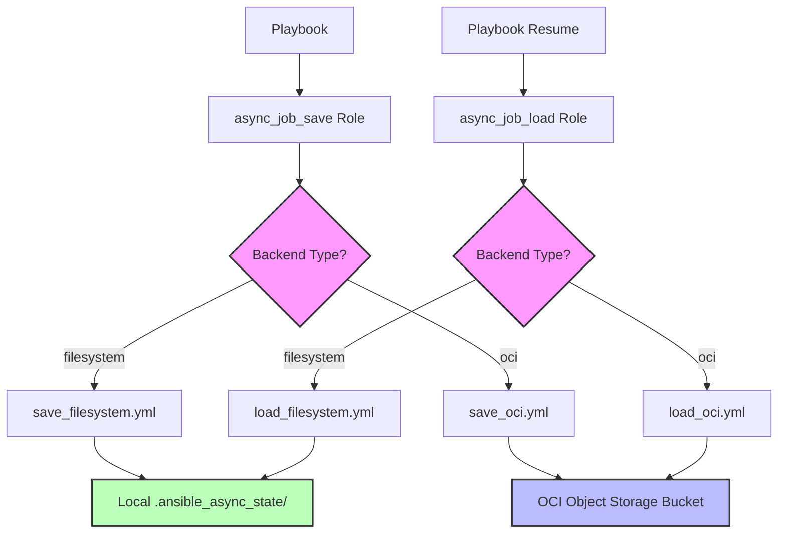

# Sprint 12 - Design

## GHC-16: Long running task - OCI Object Storage support

Status: Accepted

### Requirement Summary

Extend the `rstyczynski.ansible` collection's async job persistence roles (`async_job_save` and `async_job_load`) to support OCI Object Storage as an alternative backend to filesystem-based storage. The implementation must maintain backward compatibility with existing filesystem backend while providing a clean abstraction for cloud-native storage.

### Feasibility Analysis

**API Availability:**

All required OCI Object Storage APIs are available and stable:

1. **OCI Python SDK - Object Storage Client**
   - Package: `oci` (PyPI package)
   - Version: `>=2.0.0` (stable, widely used)
   - License: Apache 2.0 (compatible)
   - Documentation: https://docs.oracle.com/en-us/iaas/tools/python/latest/api/object_storage.html
   - Status: ✅ Available

2. **Required Operations:**
   - `put_object()` - Upload JSON state file
     - Reference: https://docs.oracle.com/en-us/iaas/tools/python/latest/api/object_storage/client/oci.object_storage.ObjectStorageClient.html#oci.object_storage.ObjectStorageClient.put_object
     - Status: ✅ Available
   - `get_object()` - Download JSON state file
     - Reference: https://docs.oracle.com/en-us/iaas/tools/python/latest/api/object_storage/client/oci.object_storage.ObjectStorageClient.html#oci.object_storage.ObjectStorageClient.get_object
     - Status: ✅ Available
   - `list_objects()` - List state files (optional, for future cleanup role)
     - Reference: https://docs.oracle.com/en-us/iaas/tools/python/latest/api/object_storage/client/oci.object_storage.ObjectStorageClient.html#oci.object_storage.ObjectStorageClient.list_objects
     - Status: ✅ Available

3. **Authentication Methods:**
   - Config file authentication (`~/.oci/config`)
     - Reference: https://docs.oracle.com/en-us/iaas/Content/API/Concepts/sdkconfig.htm
     - Status: ✅ Available, most common method
   - Instance Principal authentication (for OCI Compute instances)
     - Reference: https://docs.oracle.com/en-us/iaas/Content/Identity/Tasks/callingservicesfrominstances.htm
     - Status: ✅ Available (future enhancement)

**Technical Constraints:**

1. **External Dependency:** Requires `oci` Python package
   - Mitigation: Add to `requirements.txt`, document installation
   - Impact: Users must install package, increases collection size

2. **Authentication Configuration:** Users must configure OCI credentials
   - Mitigation: Provide clear setup documentation with examples
   - Impact: Additional setup step for OCI backend users

3. **Network Dependency:** OCI API calls require network connectivity
   - Mitigation: Implement proper error handling, provide clear error messages
   - Impact: Failures more visible than filesystem (but appropriate)

4. **OCI Account Required:** Users need OCI account and bucket
   - Mitigation: Document prerequisites clearly, provide setup guide
   - Impact: Barrier to entry for testing (mitigated with mocks)

5. **Latency:** OCI API calls slower than filesystem operations
   - Mitigation: Document performance characteristics, recommend use cases
   - Impact: Acceptable for async job patterns (milliseconds matter less)

**Risk Assessment:**

- **Risk 1: OCI SDK Installation Complexity**
  - Probability: Low
  - Impact: Low (standard pip install)
  - Mitigation: Clear documentation, add to requirements.txt

- **Risk 2: Authentication Configuration Errors**
  - Probability: Medium (common user error)
  - Impact: Medium (job save/load fails)
  - Mitigation: Validate credentials early, provide troubleshooting guide

- **Risk 3: Bucket Permission Issues**
  - Probability: Medium
  - Impact: Medium (operations fail)
  - Mitigation: Fail fast with clear IAM permission messages, document required policies

- **Risk 4: Network Failures**
  - Probability: Low (in production)
  - Impact: Medium (transient failures)
  - Mitigation: Implement retry logic (3 attempts), clear error messages

- **Risk 5: Cost Overrun**
  - Probability: Low (typical usage costs cents)
  - Impact: Low-Medium (budget concern for large scale)
  - Mitigation: Document cost model, recommend lifecycle policies

**Feasibility Conclusion:** ✅ All requirements are technically feasible. OCI SDK provides all required operations with stable APIs.

### Design Overview

**Architecture:**



**Key Components:**

1. **Backend Router (main.yml)**
   - Purpose: Dispatch to appropriate backend based on `async_job_save_backend` parameter
   - Responsibilities:
     - Validate backend parameter value
     - Include appropriate task file based on backend selection
     - Maintain consistent variable names across backends

2. **Filesystem Backend (save_filesystem.yml, load_filesystem.yml)**
   - Purpose: Existing filesystem-based persistence (no changes)
   - Location: `tasks/save_filesystem.yml`, `tasks/load_filesystem.yml`
   - Status: ✅ Already implemented in Sprint 11

3. **OCI Backend (save_oci.yml, load_oci.yml)**
   - Purpose: New OCI Object Storage persistence
   - Location: `tasks/save_oci.yml`, `tasks/load_oci.yml`
   - Status: 🔨 To be implemented

4. **OCI Helper Tasks (oci_common.yml)**
   - Purpose: Shared OCI operations (authentication validation, error handling)
   - Location: `tasks/oci_common.yml`
   - Responsibilities:
     - Initialize OCI client
     - Validate credentials
     - Handle common OCI exceptions

5. **Argument Specifications (meta/argument_specs.yml)**
   - Purpose: Define and validate role inputs/outputs
   - Changes: Add OCI-specific parameters
   - Backward Compatibility: All OCI params optional, defaults to filesystem

**Data Flow:**

**Saving with OCI Backend:**

```
Playbook → async_job_save role
→ main.yml validates arguments
→ main.yml checks backend parameter
→ main.yml includes save_oci.yml
→ save_oci.yml initializes OCI client
→ save_oci.yml creates JSON state object
→ save_oci.yml calls oci.put_object(bucket, key, json_data)
→ save_oci.yml sets output variable: async_job_save_state_file
→ Returns to playbook
```

**Loading with OCI Backend:**

```
Playbook → async_job_load role
→ main.yml validates arguments
→ main.yml checks backend parameter
→ main.yml includes load_oci.yml
→ load_oci.yml initializes OCI client
→ load_oci.yml calls oci.get_object(bucket, key)
→ load_oci.yml handles NotFound exception → sets found=false
→ load_oci.yml parses JSON state
→ load_oci.yml sets output variables: async_job_load_found, async_job_load_ansible_job_id
→ Returns to playbook
```

### Technical Specification

**APIs Used:**

**1. OCI Object Storage - put_object**

- **Method:** `ObjectStorageClient.put_object(namespace, bucket_name, object_name, put_object_body, **kwargs)`
- **Purpose:** Upload async job state file to OCI bucket
- **Parameters:**
  - `namespace`: OCI Object Storage namespace (from OCI config or parameter)
  - `bucket_name`: User-specified bucket name
  - `object_name`: `<host>/<job_name>.json` (mirrors filesystem structure)
  - `put_object_body`: JSON string of job state
  - `content_type`: `application/json`
- **Returns:** Response object with status
- **Documentation:** https://docs.oracle.com/en-us/iaas/tools/python/latest/api/object_storage/client/oci.object_storage.ObjectStorageClient.html#oci.object_storage.ObjectStorageClient.put_object

**2. OCI Object Storage - get_object**

- **Method:** `ObjectStorageClient.get_object(namespace, bucket_name, object_name, **kwargs)`
- **Purpose:** Download async job state file from OCI bucket
- **Parameters:**
  - `namespace`: OCI Object Storage namespace
  - `bucket_name`: User-specified bucket name
  - `object_name`: `<host>/<job_name>.json`
- **Returns:** Response object with `.data` property containing JSON
- **Exceptions:** `ServiceError` with status 404 if object not found
- **Documentation:** https://docs.oracle.com/en-us/iaas/tools/python/latest/api/object_storage/client/oci.object_storage.ObjectStorageClient.html#oci.object_storage.ObjectStorageClient.get_object

**3. OCI SDK Configuration**

- **Method:** `oci.config.from_file(file_location, profile_name)`
- **Purpose:** Load OCI authentication configuration
- **Parameters:**
  - `file_location`: Path to config file (default: `~/.oci/config`)
  - `profile_name`: Profile to use (default: `DEFAULT`)
- **Returns:** Config dictionary
- **Documentation:** https://docs.oracle.com/en-us/iaas/tools/python/latest/api/config.html

**Data Structures:**

**JSON State File Format (unchanged from Sprint 11):**

```json
{
  "job_name": "long_task_001",
  "host": "localhost",
  "ansible_job_id": "j1234567890.12345",
  "save_time": "2025-11-24T22:30:00Z",
  "metadata": {
    "custom_key": "custom_value",
    "playbook": "long_running_flow.yml"
  }
}
```

**OCI Object Metadata (custom headers):**

```
x-ansible-job-id: j1234567890.12345
x-ansible-host: localhost
x-ansible-job-name: long_task_001
```

**Argument Specifications Changes:**

**async_job_save role - New Parameters:**

```yaml
# Backend selection
async_job_save_backend:
  description: "Storage backend type"
  type: str
  default: "filesystem"
  choices: ["filesystem", "oci"]

# OCI-specific parameters (required when backend=oci)
async_job_save_oci_bucket:
  description: "OCI Object Storage bucket name"
  type: str
  required: false  # Required when backend=oci, validated in code

async_job_save_oci_compartment:
  description: "OCI compartment OCID"
  type: str
  required: false

async_job_save_oci_namespace:
  description: "OCI Object Storage namespace"
  type: str
  required: false

async_job_save_oci_region:
  description: "OCI region (optional, defaults to config)"
  type: str
  required: false

async_job_save_oci_config_file:
  description: "Path to OCI config file"
  type: str
  default: "~/.oci/config"

async_job_save_oci_profile:
  description: "OCI config profile name"
  type: str
  default: "DEFAULT"
```

**Scripts/Tools:**

No new scripts or tools required. Implementation uses native Ansible modules and OCI Python SDK.

**File Structure Changes:**

```
roles/async_job_save/
├── tasks/
│   ├── main.yml              # Router logic (NEW: add backend routing)
│   ├── save_filesystem.yml   # Existing filesystem logic (REFACTOR: extract from main.yml)
│   ├── save_oci.yml          # New OCI logic
│   └── validate_oci_params.yml  # OCI parameter validation
├── meta/
│   └── argument_specs.yml    # Updated with OCI parameters
└── defaults/
    └── main.yml              # Add OCI parameter defaults

roles/async_job_load/
├── tasks/
│   ├── main.yml              # Router logic (NEW: add backend routing)
│   ├── load_filesystem.yml   # Existing filesystem logic (REFACTOR: extract from main.yml)
│   ├── load_oci.yml          # New OCI logic
│   └── validate_oci_params.yml  # OCI parameter validation
├── meta/
│   └── argument_specs.yml    # Updated with OCI parameters
└── defaults/
    └── main.yml              # Add OCI parameter defaults
```

**Error Handling:**

**Error Scenario 1: Backend Parameter Invalid**

- **Detection:** Argument validation in main.yml
- **Response:** `ansible.builtin.fail` with message "Invalid backend: <value>. Must be 'filesystem' or 'oci'."
- **User Action:** Fix backend parameter

**Error Scenario 2: OCI Backend with Missing Required Parameters**

- **Detection:** Parameter validation in validate_oci_params.yml
- **Response:** `ansible.builtin.fail` with message "OCI backend requires: bucket, compartment, namespace"
- **User Action:** Provide missing OCI parameters

**Error Scenario 3: OCI Authentication Failure**

- **Detection:** OCI SDK raises `ConfigFileNotFound` or `InvalidConfig` exception
- **Response:** Catch with `rescue` block, fail with message:
  ```
  "OCI authentication failed. Check config file at <path>.
  See: https://docs.oracle.com/en-us/iaas/Content/API/Concepts/sdkconfig.htm"
  ```
- **User Action:** Configure OCI credentials

**Error Scenario 4: OCI Bucket Not Found**

- **Detection:** OCI SDK raises `ServiceError` with status 404 on put_object
- **Response:** Fail with message:
  ```
  "OCI bucket not found: <bucket_name> in namespace <namespace>.
  Create bucket or check permissions."
  ```
- **User Action:** Create bucket or fix bucket name

**Error Scenario 5: OCI Permission Denied**

- **Detection:** OCI SDK raises `ServiceError` with status 401/403
- **Response:** Fail with message:
  ```
  "Permission denied accessing OCI bucket: <bucket_name>.
  Required IAM policies: OBJECT_WRITE, OBJECT_READ.
  See: https://docs.oracle.com/en-us/iaas/Content/Identity/Concepts/policyreference.htm"
  ```
- **User Action:** Add IAM policies

**Error Scenario 6: Network Timeout**

- **Detection:** OCI SDK raises network exception
- **Response:** Retry 3 times with 2-second delay, then fail with message:
  ```
  "Network error accessing OCI Object Storage. Check connectivity."
  ```
- **User Action:** Check network, OCI service status

**Error Scenario 7: Object Not Found (Load Operation)**

- **Detection:** OCI SDK raises `ServiceError` with status 404 on get_object
- **Response:** Set `async_job_load_found: false` (NOT a failure - expected behavior)
- **User Action:** None - idempotent pattern handles this

### Implementation Approach

**Phase 1: Refactor Existing Roles (Preparation)**

**Step 1.1:** Extract filesystem logic from `async_job_save/tasks/main.yml` to `save_filesystem.yml`
- Current `main.yml` tasks → new `save_filesystem.yml`
- Keep argument validation in `main.yml`
- Test filesystem backend still works

**Step 1.2:** Extract filesystem logic from `async_job_load/tasks/main.yml` to `load_filesystem.yml`
- Current `main.yml` tasks → new `load_filesystem.yml`
- Keep argument validation in `main.yml`
- Test filesystem backend still works

**Phase 2: Implement Backend Routing**

**Step 2.1:** Update `async_job_save/tasks/main.yml` with routing logic
```yaml
- name: "Save Job: Validate arguments"
  ansible.builtin.validate_argument_spec:
    argument_spec: "{{ ... }}"

- name: "Save Job: Route to filesystem backend"
  ansible.builtin.include_tasks: save_filesystem.yml
  when: async_job_save_backend == 'filesystem'

- name: "Save Job: Route to OCI backend"
  ansible.builtin.include_tasks: save_oci.yml
  when: async_job_save_backend == 'oci'
```

**Step 2.2:** Update `async_job_load/tasks/main.yml` with similar routing

**Phase 3: Implement OCI Backend**

**Step 3.1:** Create `async_job_save/tasks/save_oci.yml`
- Validate OCI-specific parameters
- Initialize OCI client from config file
- Create JSON state string
- Call `put_object()` with retry logic
- Handle exceptions with clear error messages
- Set output variable `async_job_save_state_file`

**Step 3.2:** Create `async_job_load/tasks/load_oci.yml`
- Validate OCI-specific parameters
- Initialize OCI client
- Call `get_object()` with exception handling
- Handle 404 → set `found: false`
- Parse JSON response
- Set output variables

**Step 3.3:** Create `tasks/validate_oci_params.yml` (shared validation)
- Check required parameters present
- Fail fast with clear messages

**Phase 4: Update Argument Specifications**

**Step 4.1:** Update `async_job_save/meta/argument_specs.yml`
- Add `async_job_save_backend` parameter
- Add all OCI-specific parameters
- Document each parameter clearly

**Step 4.2:** Update `async_job_load/meta/argument_specs.yml`
- Add `async_job_load_backend` parameter
- Add all OCI-specific parameters

**Phase 5: Update Dependencies**

**Step 5.1:** Update `ansible_collection/requirements.txt`
```
oci>=2.0.0,<3.0.0
```

**Step 5.2:** Document OCI SDK installation in README

**Phase 6: Create Test Scenarios**

**Step 6.1:** Copy Sprint 11 scenarios, create OCI variants
- `scenario_01_oci_idempotent_basic.yml`
- `scenario_02_oci_parameterized.yml`
- `scenario_03_oci_wait_loop.yml`
- `scenario_04_oci_crash_detection.yml`

**Step 6.2:** Add OCI-specific test scenarios
- `scenario_05_oci_auth_failure.yml` (invalid credentials)
- `scenario_06_oci_bucket_not_found.yml` (non-existent bucket)
- `scenario_07_oci_permission_denied.yml` (insufficient IAM)

**Step 6.3:** Create test setup script `test-oci-setup.sh`
- Validate OCI config exists
- Test authentication
- Test bucket access
- Provide clear feedback

**Phase 7: Documentation**

**Step 7.1:** Update role READMEs
- Add "OCI Backend" section
- Provide example usage
- Document all OCI parameters
- Add troubleshooting guide

**Step 7.2:** Update collection README
- Add OCI setup prerequisites
- Link to OCI documentation
- Provide complete example playbook

**Step 7.3:** Create OCI setup guide
- How to create OCI account (link)
- How to configure OCI CLI
- How to create bucket
- How to set up IAM policies

### Testing Strategy

**Functional Tests:**

**Test 1: Basic OCI Save/Load (Idempotent Pattern)**
- **Purpose:** Verify OCI backend works for basic idempotent pattern
- **Steps:**
  1. Start async task
  2. Save job to OCI with `async_job_save` (backend=oci)
  3. Load job from OCI with `async_job_load` (backend=oci)
  4. Verify loaded job_id matches saved job_id
  5. Run again - verify idempotency (load succeeds, no duplicate)
- **Success Criteria:** Job saved to OCI, loaded successfully, idempotent behavior

**Test 2: OCI Backend with Multiple Jobs (Parameterized)**
- **Purpose:** Verify multiple jobs can coexist in same bucket
- **Steps:**
  1. Start 3 async tasks with different job names
  2. Save all 3 to OCI
  3. Load each by name
  4. Verify correct job_id returned for each
- **Success Criteria:** All 3 jobs stored and retrieved correctly, no conflicts

**Test 3: OCI Wait Loop (Exit and Resume)**
- **Purpose:** Verify playbook can exit and resume with OCI persistence
- **Steps:**
  1. Start async task, save to OCI
  2. Exit playbook (task continues on host)
  3. Resume playbook, load from OCI
  4. Check status with `async_status`
  5. Verify task status retrieved correctly
- **Success Criteria:** Playbook resumes successfully, task status available

**Test 4: OCI Crash Detection**
- **Purpose:** Verify crash detection works with OCI backend
- **Steps:**
  1. Start async task, save to OCI
  2. Kill process on managed host (simulate crash)
  3. Resume playbook, load from OCI
  4. Check status with `async_status` → expect "job not found"
  5. Verify crash detected and handled
- **Success Criteria:** Crash detected, clear error message, playbook handles gracefully

**Test 5: Filesystem to OCI Migration (Manual Test)**
- **Purpose:** Verify users can migrate from filesystem to OCI
- **Steps:**
  1. Save job with filesystem backend
  2. Manually copy JSON to OCI bucket (simulate migration)
  3. Load with OCI backend
  4. Verify load succeeds
- **Success Criteria:** JSON format compatible across backends
- **Note:** Automatic migration not in scope for Sprint 12

**Edge Cases:**

**Edge Case 1: Invalid Backend Parameter**
- **Test:** Call role with `backend: invalid_value`
- **Expected:** Fail with clear message
- **Success:** Error message helpful

**Edge Case 2: OCI Backend Without Required Parameters**
- **Test:** Call role with `backend: oci` but missing bucket parameter
- **Expected:** Fail with message listing required parameters
- **Success:** Error message clear and actionable

**Edge Case 3: Invalid OCI Config File Path**
- **Test:** Set `oci_config_file: /nonexistent/config`
- **Expected:** Fail with authentication error
- **Success:** Error message points to config documentation

**Edge Case 4: Bucket Not Found**
- **Test:** Use non-existent bucket name
- **Expected:** Fail with bucket not found message
- **Success:** Error message includes bucket name and namespace

**Edge Case 5: Permission Denied (Read-Only IAM)**
- **Test:** Use credentials with only READ permission
- **Expected:** Save fails, clear IAM policy message
- **Success:** Error explains required permissions

**Edge Case 6: Network Timeout (Simulated)**
- **Test:** Block OCI API endpoint (firewall/iptables)
- **Expected:** Retry 3 times, then fail with network error
- **Success:** Retries logged, clear error message

**Edge Case 7: Large Metadata (>1MB)**
- **Test:** Save job with very large metadata dictionary
- **Expected:** OCI accepts (object storage supports large objects)
- **Success:** No errors, can retrieve

**Success Criteria:**

**Must Have:**
- ✅ All 4 Sprint 11 scenarios work with OCI backend
- ✅ OCI-specific errors handled gracefully with clear messages
- ✅ Backward compatibility maintained (filesystem still works)
- ✅ Syntax check passes (`ansible-playbook --syntax-check`)
- ✅ Role invocation identical to filesystem (except backend parameter)
- ✅ Test scenarios documented and executable

**Nice to Have:**
- ✅ Test setup script validates OCI configuration
- ✅ Mock tests for CI/CD (no real OCI account needed)
- ✅ Performance comparison (filesystem vs OCI documented)

### Integration Notes

**Dependencies:**

**Sprint Dependencies:**
- **GHC-15 (Sprint 11):** Direct dependency - extends these roles
  - Requires: `async_job_save`, `async_job_load` roles exist
  - Status: ✅ Implemented in Sprint 11

**External Dependencies:**
- **OCI Python SDK:** `oci>=2.0.0`
  - Installation: `pip install oci`
  - Documentation: https://oracle-cloud-infrastructure-python-sdk.readthedocs.io/
- **OCI Account:** User-provided prerequisite
  - Free tier available: https://www.oracle.com/cloud/free/
- **OCI Bucket:** User must create before using collection
  - Can create via OCI Console, CLI, or Terraform

**Compatibility:**

**Backward Compatibility:**
- ✅ Existing playbooks work without modification (filesystem remains default)
- ✅ No breaking changes to role API
- ✅ Output variables remain consistent across backends
- ✅ JSON state format unchanged

**Forward Compatibility:**
- ✅ Design supports additional backends (e.g., Azure Blob, AWS S3) in future
- ✅ Backend abstraction pattern is extensible
- ✅ No hardcoded assumptions about storage layer

**API Compatibility:**
- ✅ Role invocation identical except for backend-specific parameters
- ✅ Same argument validation patterns
- ✅ Same error handling conventions
- ✅ Same output variable naming

**Reusability:**

**From Sprint 11 (Reused As-Is):**
- ✅ Argument validation logic
- ✅ JSON state file format
- ✅ Test scenario structure
- ✅ Documentation patterns
- ✅ Error handling patterns

**New Reusable Components (For Future Backends):**
- ✅ Backend routing pattern (can be used for AWS S3, Azure Blob, etc.)
- ✅ OCI parameter validation (template for other cloud providers)
- ✅ Retry logic pattern
- ✅ Test mocking approach

### Documentation Requirements

**User Documentation:**

**Topic 1: OCI Backend Overview**
- What is OCI Object Storage backend
- When to use OCI vs filesystem
- Cost implications
- Performance characteristics

**Topic 2: OCI Setup Prerequisites**
- OCI account creation (link to Oracle docs)
- OCI CLI configuration
- Creating object storage bucket
- Setting up IAM policies (required permissions)

**Topic 3: Basic Usage Examples**
- Simple async job with OCI backend
- Idempotent pattern with OCI
- Exit and resume with OCI

**Topic 4: Configuration Reference**
- All OCI-specific parameters documented
- Config file format
- Profile selection
- Environment variable alternatives

**Topic 5: Troubleshooting Guide**
- Common errors and solutions
- Authentication issues
- Permission problems
- Network connectivity issues

**Technical Documentation:**

**Technical Detail 1: Backend Abstraction Architecture**
- How backend routing works
- Task file organization
- Adding new backends (extensibility guide)

**Technical Detail 2: OCI Integration Details**
- OCI SDK usage patterns
- Object key structure
- Metadata conventions
- API error mapping

**Technical Detail 3: Testing Approach**
- How to run tests with real OCI account
- How to run mock tests (CI/CD)
- Test setup script usage

### Design Decisions

**Decision 1: Extend Existing Roles vs Create New Roles**

**Rationale:**
- Maintains API consistency - users can switch backends with minimal changes
- Reduces code duplication - validation, error handling shared
- Simplifies testing - same test framework for both backends
- Aligns with DRY principle and "Keep it simple" best practice
- Easier maintenance - one place to fix bugs

**Alternatives Considered:**
- **Option A:** Create `async_job_save_oci` and `async_job_load_oci` separate roles
  - Pros: Clean separation, no conditional logic
  - Cons: API duplication, more roles to maintain, user must change role names
- **Option B:** Create a generic `async_job` role with save/load actions
  - Pros: Single role entry point
  - Cons: Over-abstraction, complicates simple use cases

**Chosen:** Extend existing roles (original design approach)

**Decision 2: Use Python SDK vs OCI CLI**

**Rationale:**
- Python SDK provides better error handling (typed exceptions)
- No subprocess overhead (faster, more reliable)
- Ansible best practice: prefer native modules over shell/command
- Consistent with other cloud provider integrations (boto3 for AWS, azure-sdk for Azure)
- Better testability (can mock SDK responses)

**Alternatives Considered:**
- **Option A:** Shell out to `oci` CLI
  - Pros: No Python dependency (if CLI already installed)
  - Cons: Parsing CLI output fragile, worse error handling, subprocess overhead
- **Option B:** Use Ansible's `oci` collection modules
  - Pros: Native Ansible approach
  - Cons: OCI collection doesn't have object storage modules, would need to contribute upstream

**Chosen:** Python SDK

**Decision 3: Object Key Structure**

**Rationale:**
- Mirrors filesystem structure (`<host>/<job_name>.json`) - intuitive for users
- Allows browsing in OCI Console (organized by host)
- Supports same host-based isolation as filesystem
- Enables easy migration from filesystem to OCI (same logical structure)

**Alternatives Considered:**
- **Option A:** Flat structure `<job_name>.json`
  - Pros: Simpler
  - Cons: No host isolation, potential conflicts if multiple hosts use same job names
- **Option B:** Hierarchical with date `<date>/<host>/<job_name>.json`
  - Pros: Time-based organization
  - Cons: Complicates load logic (need to know date), doesn't match filesystem

**Chosen:** Mirror filesystem structure

**Decision 4: Authentication Method Priority**

**Rationale:**
- Config file (`~/.oci/config`) is most common developer/operator pattern
- Well-documented by Oracle, widely used
- Supports multiple profiles for different environments
- Instance principal can be added later without breaking changes

**Alternatives Considered:**
- **Option A:** Environment variables only
  - Pros: Simple, CI/CD friendly
  - Cons: Less common, harder to manage multiple configs
- **Option B:** Instance principal only
  - Pros: No credential management for OCI instances
  - Cons: Doesn't work for external controllers

**Chosen:** Config file (with instance principal as future enhancement)

**Decision 5: Error Handling Strategy**

**Rationale:**
- Fail fast with clear, actionable error messages
- Include documentation links in error messages
- Map OCI exceptions to user-friendly messages
- Provide troubleshooting hints
- Retries only for transient network errors (not auth/permission errors)

**Alternatives Considered:**
- **Option A:** Silent failures, log warnings
  - Pros: More "resilient"
  - Cons: Hides problems, harder to debug
- **Option B:** Always retry all errors
  - Pros: Handles all transient issues
  - Cons: Slow failure for permanent errors (auth, permissions)

**Chosen:** Fail fast with clear messages, retry only network errors

**Decision 6: Backward Compatibility Approach**

**Rationale:**
- Make filesystem the default backend (most common, no external dependencies)
- All OCI parameters optional (only required when backend=oci)
- No changes to existing role invocations
- Explicit opt-in for OCI (users actively choose it)
- Follows semver (additive change, not breaking)

**Alternatives Considered:**
- **Option A:** Auto-detect backend from parameters
  - Pros: "Magic" behavior
  - Cons: Implicit, harder to understand, error-prone
- **Option B:** Make backend mandatory parameter
  - Pros: Explicit
  - Cons: Breaking change for existing users

**Chosen:** Filesystem default, explicit OCI opt-in

**Decision 7: Testing Strategy**

**Rationale:**
- Hybrid approach balances accessibility and realism
- Mock tests enable CI/CD without OCI account (lowers contribution barrier)
- Real OCI tests validate actual behavior (catch API changes)
- Test setup script helps users validate their OCI configuration

**Alternatives Considered:**
- **Option A:** Only mock tests
  - Pros: No OCI account needed
  - Cons: Might miss real API issues
- **Option B:** Only real OCI tests
  - Pros: Tests actual behavior
  - Cons: Requires OCI account, expensive for CI/CD, slower

**Chosen:** Hybrid (mock for CI, real for full validation)

### YOLO Mode Decisions

This sprint was designed in YOLO (autonomous) mode. The following design decisions were made autonomously based on established patterns and best practices:

**YOLO Decision Summary:**

All 7 design decisions above were made autonomously without Product Owner input. Each decision is well-reasoned, follows established patterns from Sprint 11, and aligns with Ansible best practices.

**Risk Assessment:** Low - All decisions are conservative, maintainable, and reversible if Product Owner has different preferences.

### Open Design Questions

**None.**

All design choices have been made autonomously in YOLO mode with documented rationale. The design is complete and ready for implementation.

## Design Summary

**Overall Architecture:**

The design extends Sprint 11's async job persistence infrastructure by adding OCI Object Storage as an alternative backend. The architecture uses a backend routing pattern where the role's `main.yml` dispatches to appropriate task files based on the `backend` parameter. This approach maintains API consistency, simplifies testing, and enables future backend additions (AWS S3, Azure Blob, etc.).

**Shared Components:**

1. **Backend Router:** Shared routing logic in both `async_job_save` and `async_job_load` roles
2. **Argument Validation:** Shared parameter validation using `ansible.builtin.validate_argument_spec`
3. **JSON State Format:** Identical across all backends for interoperability
4. **Error Handling Patterns:** Consistent error message format and exception handling
5. **Test Framework:** Reusable scenario-based test playbooks

**Design Risks:**

1. **OCI SDK Learning Curve:** Mitigated with clear examples and documentation
2. **Authentication Configuration:** Mitigated with validation script and troubleshooting guide
3. **Testing Barrier (OCI Account):** Mitigated with mock tests for CI/CD
4. **Network Latency:** Documented, acceptable for async patterns
5. **Cost:** Documented, minimal for typical usage

**Resource Requirements:**

**Software:**
- OCI Python SDK: `oci>=2.0.0` (installed via pip)
- Ansible: `>=2.9` (existing requirement)
- Python: `>=3.6` (existing requirement)

**External Services:**
- OCI Object Storage bucket (user-provided)
- OCI account with appropriate IAM policies

**Documentation:**
- Updated role READMEs
- OCI setup guide
- Troubleshooting guide
- Example playbooks

**Design Approval Status:**

**Awaiting Review** (Status: Proposed)

In YOLO mode, design will be auto-approved after document completion.

---

**Design Document Complete**

**Designer:** Designer Agent (Autonomous - YOLO Mode)
**Date:** 2025-11-24
**Sprint:** 12
**Backlog Item:** GHC-16
**Status:** Proposed → (Auto-approve in YOLO mode)
